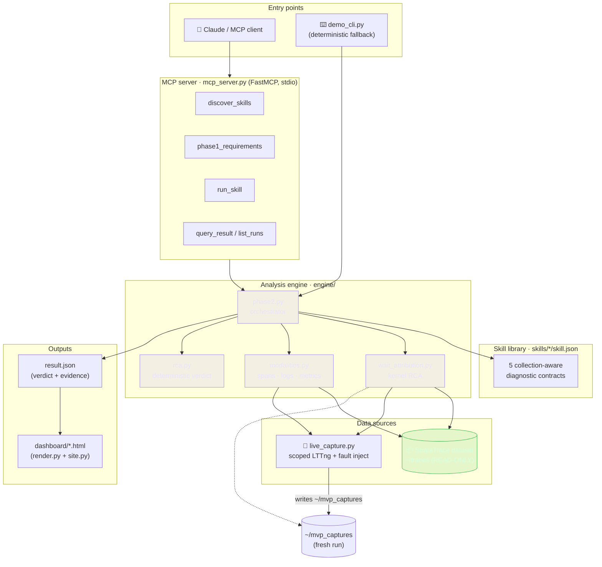
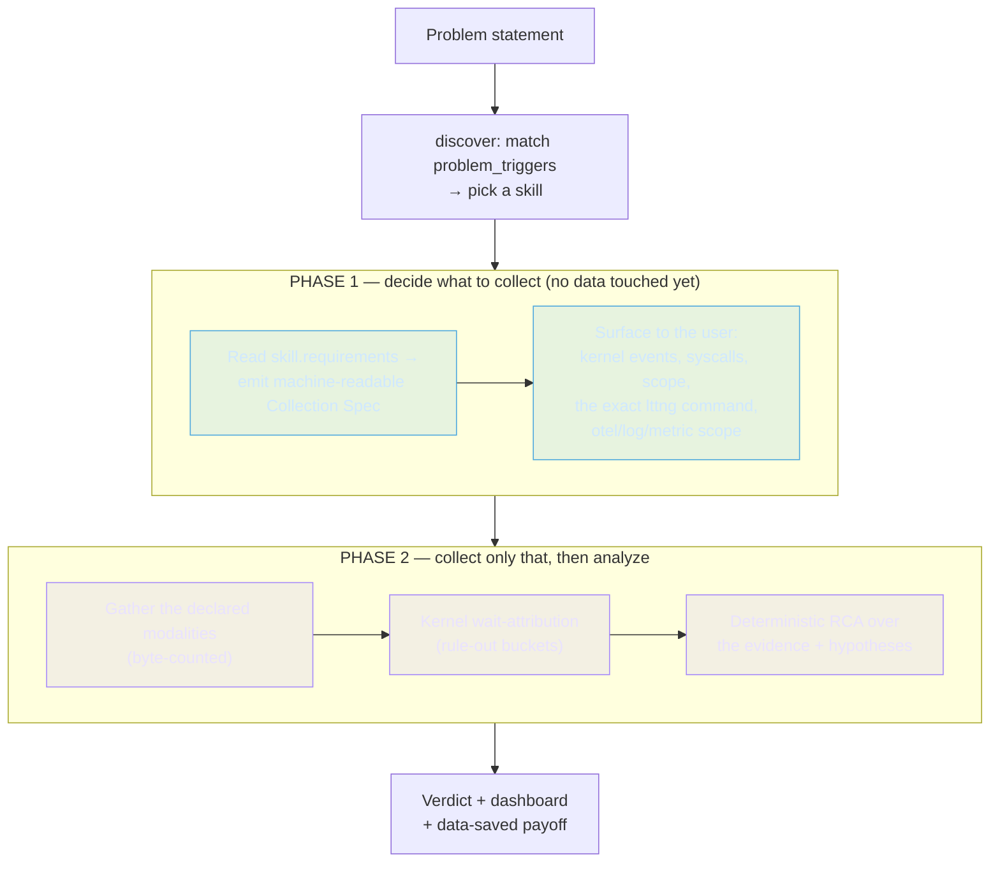
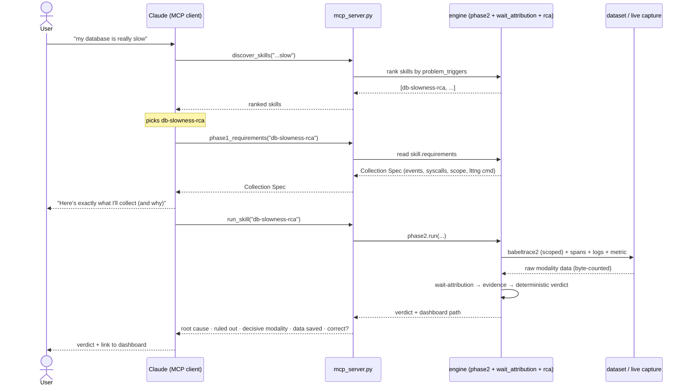
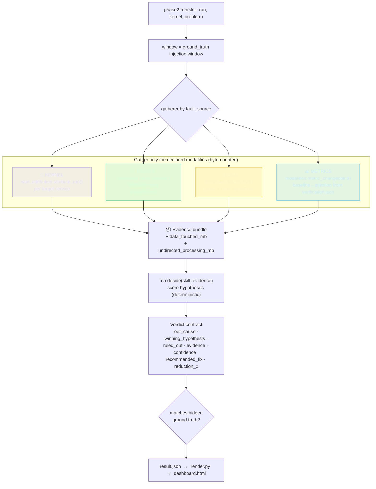
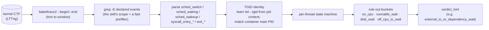
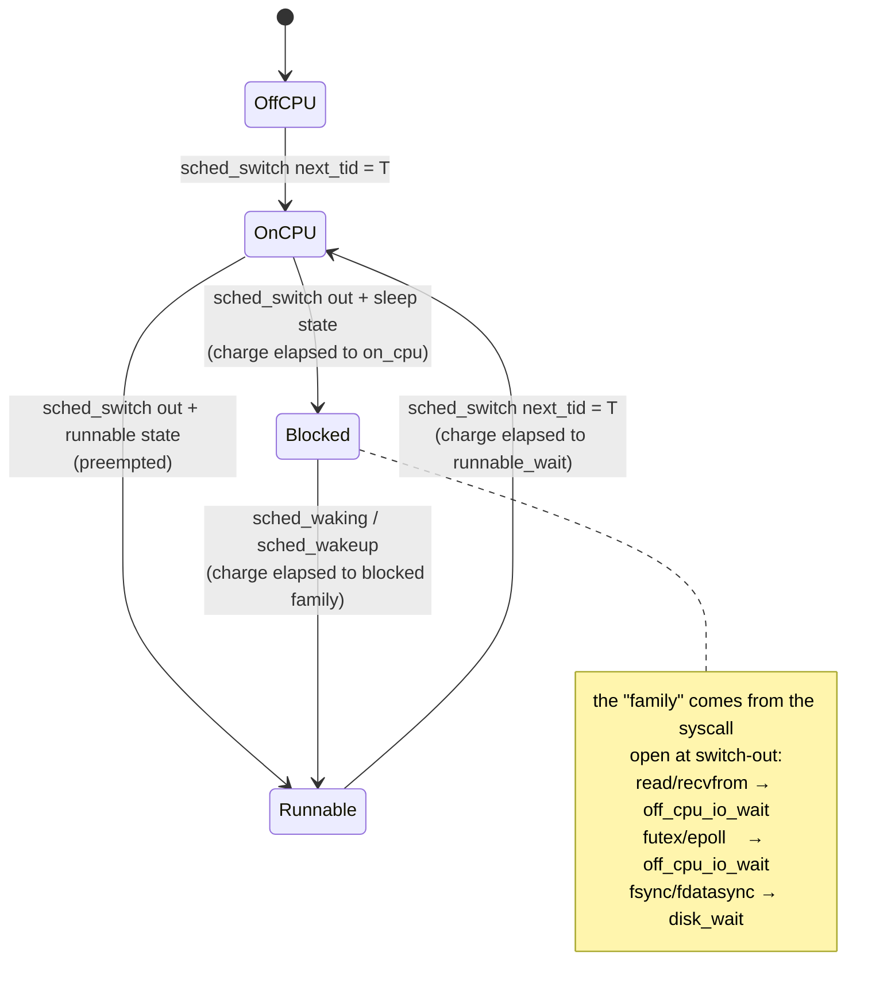
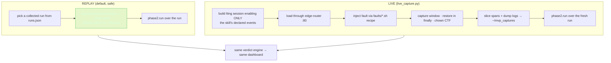
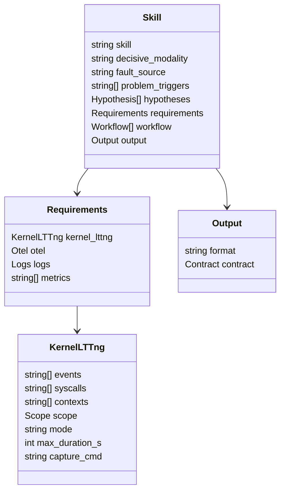
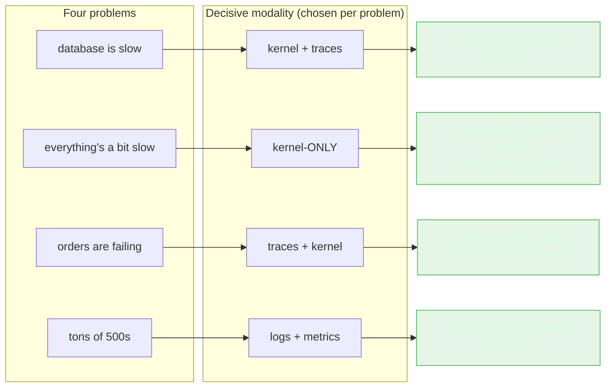

# Agent-First, Collection-Aware Observability — Architecture & Documentation

> A skill compiles a plain-language problem (*"my database is slow"*) into a scoped,
> machine-readable **collection spec**, then runs a **kernel-deep** root-cause analysis
> over four modalities (kernel traces, distributed traces, logs, metrics) and returns a
> clean verdict. The novel unit is the **collection-aware skill**: it decides *what to
> collect from the problem statement* — differently for every problem — which no incumbent
> (Datadog, Dynatrace) or academic system (TMLL, HolmesGPT) does.

This document explains the idea, the architecture, the data flow, how the MCP layer runs,
the inputs/outputs at each stage, and how to use it. All diagrams are Mermaid (they render
on GitHub and in most Markdown viewers). Everything here maps to real code under
`agent-first-mvp/`.

---

## Table of contents
1. [The core idea](#1-the-core-idea)
2. [System architecture](#2-system-architecture)
3. [The two-phase model](#3-the-two-phase-model)
4. [How the MCP layer runs](#4-how-the-mcp-layer-runs)
5. [The analysis pipeline (Phase 2)](#5-the-analysis-pipeline-phase-2)
6. [The kernel wait-attribution engine](#6-the-kernel-wait-attribution-engine)
7. [Live vs replay](#7-live-vs-replay)
8. [Data contracts](#8-data-contracts)
9. [Usage](#9-usage)
10. [What the benchmark proves](#10-what-the-benchmark-proves)
11. [Repository map](#11-repository-map)

---

## 1. The core idea

Kernel-deep tracing produces gigabytes-to-terabytes; you cannot capture everything, all the
time, on every service. Existing tools **dashboard what was already collected** — they do
not decide *what to collect* from the user's problem. This project inverts that: the problem
statement drives a **scoped** collection plan, and only that is collected and analyzed.

```mermaid
flowchart LR
    P["🗣️ Plain-language problem<br/>&quot;my database is slow&quot;"]
    S{{"🧩 Skill<br/>collection-aware<br/>diagnostic contract"}}
    SPEC["📋 Collection Spec<br/>only these kernel events +<br/>syscalls, on these services, ≤60s"]
    COL["🔬 Scoped collection<br/>kernel · traces · logs · metrics"]
    AN["⚙️ Kernel-deep RCA<br/>per-thread wait-attribution<br/>+ rule-out reasoning"]
    V["✅ Verdict<br/>root cause · ruled out ·<br/>decisive modality · fix · data saved"]

    P --> S
    S -->|"Phase 1: emit requirements"| SPEC
    SPEC -->|"Phase 2: collect + analyze"| COL
    COL --> AN
    AN --> V

    classDef hi fill:#4ea8de22,stroke:#4ea8de,color:#cfe8ff;
    class S,SPEC hi;
```



**Why it matters.** For one `slow_db` run, answering the question with the skill's scope
touched ≈420 MB, versus ≈13 GB an undirected kernel-deep pass would ingest (full decompressed
kernel + all spans/logs) — the same correct answer for ~30× less data. And because the scope
is chosen per problem, a *different* modality turns out to be decisive each time.

---

## 2. System architecture

Three entry points (an AI agent over MCP, a deterministic CLI, or a live-capture driver) all
feed the same engine, which reads either the pre-collected dataset or a fresh live capture and
emits a JSON verdict plus a self-contained HTML dashboard.



**Design principle — every ambitious piece has a proven fallback:** agent+MCP → CLI;
kernel graph → babeltrace2 subprocess; live capture → replay over the dataset; LLM narration
→ deterministic verdict.

---

## 3. The two-phase model

The skill runs in two phases so the *collection decision* is explicit and inspectable before
any data is touched — that separation is the whole point.



- **Phase 1 output** = the *Collection Spec* (see [§8](#8-data-contracts)). It is derived
  from `skill.requirements` and includes the literal `lttng enable-event` command that would
  scope a live capture. This is what makes the system *collection-aware* rather than
  dashboard-after-the-fact.
- **Phase 2** collects only what Phase 1 declared, counts the bytes actually read, runs the
  analysis, and produces the verdict.

---

## 4. How the MCP layer runs

`mcp_server.py` is a **FastMCP** server speaking **MCP over stdio**. An MCP client (Claude
Code, configured via `.mcp.json`) discovers the tools and calls them; the agent orchestrates
the two-phase loop from the user's sentence. The server has **no stdout prints** (stdout is
the JSON-RPC channel) — all human-facing output flows through tool return values.

### The agent loop (sequence)



### Tools — inputs and outputs

| Tool | Input | Output |
|---|---|---|
| `discover_skills` | `problem: str` | ranked list of `{skill, score, decisive_modality, fault_source}` |
| `phase1_requirements` | `skill: str`, `problem=""` | the **Collection Spec**: `{skill, decisive_modality, hypotheses, collection_spec{kernel{events, syscalls, scope, mode, max_duration_s, capture_cmd}, otel, logs, metrics}}` |
| `run_skill` | `skill: str`, `problem=""`, `max_seconds=0` | `{problem, skill, mode, root_cause, decisive_modality, confidence, ruled_out[], evidence[], data_touched_mb, reduction_x, correct_vs_ground_truth, dashboard}` |
| `query_result` | `skill: str` | the stored `result.json` (verdict + full evidence bundle) |
| `list_runs` | — | registered replay runs (one per fault family) |

Plus an MCP **resource** `skill://{name}` (returns the raw `skill.json` contract) and an MCP
**prompt** `diagnose(problem)` that guides an agent through the three-call loop.

### `.mcp.json` (how a client launches it)

```json
{
  "mcpServers": {
    "collection-aware-rca": {
      "command": "python3",
      "args": ["agent-first-mvp/mcp_server.py"]
    }
  }
}
```

> If the `mcp`/`fastmcp` package is unavailable, `demo_cli.py` runs the *identical* logic
> deterministically — the demo never depends on the agent being live.

---

## 5. The analysis pipeline (Phase 2)

`phase2.run()` dispatches on the skill's `fault_source` to a **gatherer** that collects only
the declared modalities (each reader returns bytes-touched), assembles an **evidence bundle**,
and hands it to a **deterministic decider** in `rca.py`.



The verdict is **deterministic** — scored by rules over the structured evidence — so the
system never *hallucinates* a root cause. An optional `rca.narrate()` can ask the `claude`
CLI to write prose over the *same* evidence, but it cannot change which hypothesis wins.

---

## 6. The kernel wait-attribution engine

This is the novel analytical core (`engine/wait_attribution.py`). For a target service's
threads it decomposes wall-time in the window into **on-CPU / runnable-wait / blocked-in-
syscall**, so we can say *why* a service was slow, not just *that* it was.

### Data flow



### Why TGID, not process name

`catalogue`, `payment`, and `user` are all Go binaries that run as `/app` (comm `app`), so
matching by comm would conflate them. Threads are instead identified by **TGID = the
container's main PID** (from `docker top`, stable and unique), learned per-thread from the
`pid` context on every event. Comm remains the fallback for aggressors (e.g. `stress-ng`)
that have no `docker top` snapshot.

### The per-thread state machine



### The rule-out framing (why it is robust)

A Go service waiting on a slow database is **not** parked in a blocking `read()` — its runtime
netpoller parks the OS thread in `epoll_pwait`/`futex`. So per-thread syscall-blocking does
*not* show "blocked reading the DB socket"; it shows off-CPU I/O-readiness wait. The decisive,
defensible claim is therefore the **rule-out**:

> on-CPU ≈ 0% and disk ≈ 0% ⇒ **not** compute-bound, **not** disk-bound ⇒ the latency is
> off-CPU external-I/O wait ⇒ (with the DB engine shown healthy) the **connection path** is
> the root cause.

Validated on the real `slow_db` run: `on_cpu 0.7% · runnable 0.1% · disk 0.0% · off_cpu_io
99.2%` → `external_io_or_dependency_wait`. Correct vs ground truth.

---

## 7. Live vs replay

The same engine runs over the pre-collected dataset (**replay**, the safe default) or over a
**live** scoped capture. Live is the collection-aware thesis demonstrated in real time.



**Live gotchas that are already handled** (both would fail silently otherwise): a `sudo
lttng` trace is root-owned → `chown` it back before babeltrace2; and the load must hit the
edge-router on `:80` (not the load generator's stale `:30001` default) or the capture gets no
traffic.

**Dataset safety:** all analysis is READ-ONLY on `~/traces`; decompressed working copies live
in `~/mvp_work/`, live captures in `~/mvp_captures/`, and a full-disk snapshot backs up the
dataset.

---

## 8. Data contracts

### Skill contract (`skills/<name>/skill.json`)



### The three key JSON shapes

**Collection Spec** (Phase 1 output — *what to collect*):
```json
{
  "skill": "db-slowness-rca",
  "decisive_modality": "kernel+traces",
  "hypotheses": ["db_conn_path_latency", "db_disk_io", "service_cpu_bound"],
  "collection_spec": {
    "kernel": {
      "events": ["sched_switch", "sched_waking", "sched_wakeup"],
      "syscalls": ["recvfrom", "sendto", "read", "write", "futex", "epoll_pwait"],
      "scope": {"target_services": ["catalogue", "catalogue-db"]},
      "mode": "snapshot", "max_duration_s": 60,
      "capture_cmd": "lttng enable-event -k --syscall recvfrom,sendto,read,write,futex,epoll_pwait && lttng enable-event -k sched_switch,sched_waking,sched_wakeup"
    },
    "otel":    {"services": ["catalogue"], "signals": ["traces"]},
    "logs":    {"services": ["catalogue", "catalogue-db"], "level": "WARN+"},
    "metrics": ["histogram_quantile(0.95, ... http_request_duration_seconds ...)"]
  }
}
```

**Evidence bundle** (Phase 2 intermediate — *what was collected*):
```json
{
  "kernel": {
    "catalogue":    {"rule_out_pct": {"on_cpu": 0.7, "runnable_wait": 0.1, "disk_wait": 0.0, "off_cpu_io_wait": 99.2}, "verdict_hint": "external_io_or_dependency_wait", "n_tids_seen": 14, "scoped_bytes": 250000000},
    "catalogue-db": {"rule_out_pct": {"on_cpu": 0.0, "disk_wait": 0.0, "off_cpu_io_wait": 99.9}, "n_tids_seen": 358}
  },
  "spans":   {"catalogue": {"n": 9772, "p95_s": 2.14, "max_s": 3.24}, "front-end": {"p95_s": 2.10}},
  "logs":    {"took": {"catalogue": {"p95_ms": 2141}}, "errors": {}},
  "metrics": {"status": "confirmed", "checks": [{"name": "catalogue_p95_latency", "baseline": 0.00476, "injection": 2.36, "delta_sigma": 526162}]},
  "data_touched_mb": 417.5, "undirected_processing_mb": 13269.5
}
```

**Verdict contract** (Phase 2 output — *the answer*):
```json
{
  "root_cause": "Latency in the catalogue→database connection path ...",
  "winning_hypothesis": "db_conn_path_latency",
  "ruled_out": ["service CPU-bound — catalogue on-CPU only 0.7%", "DB disk I/O — mysqld disk 0%"],
  "evidence": ["KERNEL: ...99.2% off-CPU I/O wait...", "TRACES: p95 2.14s", "METRICS: 526162σ", "LOGS: took p95 2141ms"],
  "decisive_modality": "kernel + traces",
  "confidence": 0.93,
  "recommended_fix": "Inspect the catalogue→DB connection path ...",
  "data_touched_mb": 417.5, "everything_bundle_mb": 13269.5, "reduction_x": 31.8
}
```

---

## 9. Usage

### Deterministic CLI (the reliable spine)

```bash
cd agent-first-mvp

# 1) which skill fits the problem?
python3 demo_cli.py discover "my database is really slow"

# 2) what would it collect? (Phase 1 — the differentiator)
python3 demo_cli.py phase1 db-slowness-rca

# 3) run it (Phase 2) — replay over the collected dataset
python3 demo_cli.py run db-slowness-rca

# 3b) run it LIVE — scoped LTTng capture + fault injection on the running stack
python3 demo_cli.py run db-slowness-rca --live
```

Each `run` writes `~/mvp_work/results/<skill>.json` + a self-contained
`<skill>.html` dashboard, and prints root cause · decisive modality · ruled-out ·
data-saved · correctness vs ground truth.

### Agent-driven (MCP)

```bash
python3 mcp_server.py          # stdio server exposing the 5 tools
```
With `.mcp.json` loaded in an MCP client, the user just types *"my database is slow"* and the
agent calls `discover_skills → phase1_requirements → run_skill`, surfacing the collection plan
before the verdict.

### Build the benchmark site

```bash
python3 dashboard/site.py ~/mvp_work/results skills ~/mvp_work/results/index.html
```

---

## 10. What the benchmark proves

Same engine, four problems — and a **different decisive modality is correct each time**,
which is the thesis: the system genuinely decides *what to collect*, differently per problem.



| Problem | Skill | Fault | Decisive modality | Data ↓ | Correct vs ground truth |
|---|---|---|---|---|---|
| database is slow | `db-slowness-rca` | `slow_db` | kernel + traces | ~31× | ✓ |
| everything's a bit slow | `noisy-neighbor-rca` | `noisy_neighbor` | **kernel-only** | ~13× | ✓ |
| orders are failing | `dependency-outage-rca` | `dependency_outage` | traces + kernel | ~28× | ✓ |
| tons of 500s | `error-storm-rca` | `error_storm` | logs + metrics | ~2× | ✓ |

The **noisy-neighbor** row is the sharpest proof of *why kernel depth matters*: the services'
own metrics and traces look healthy (catalogue p95 ≈ 5 ms), and only the kernel names the
co-located `stress-ng` process stealing cycles.

---

## 11. Repository map

| Path | What |
|---|---|
| `agent-first-mvp/skills/<name>/skill.json` | Collection-aware diagnostic contracts (5) |
| `agent-first-mvp/skills/<name>/SKILL.md` | Anthropic Agent-Skill doc (human/agent instructions) |
| `agent-first-mvp/engine/wait_attribution.py` | Per-thread kernel wait-attribution (TGID identity, rule-out buckets) |
| `agent-first-mvp/engine/modalities.py` | Trace/log/metric readers (byte-counted) |
| `agent-first-mvp/engine/rca.py` | Deterministic verdict + optional LLM narration |
| `agent-first-mvp/engine/phase2.py` | Phase-1 spec emitter + Phase-2 orchestrator + size accounting |
| `agent-first-mvp/mcp_server.py` · `.mcp.json` | FastMCP server (the agent interface) |
| `agent-first-mvp/demo_cli.py` | Deterministic CLI (discover / phase1 / run) |
| `agent-first-mvp/live_capture.py` | Live scoped LTTng capture + fault injection |
| `agent-first-mvp/dashboard/render.py` · `site.py` | Offline verdict dashboard + benchmark landing page |
| `agent-first-mvp/runs.json` | Replay registry: fault → collected run + kernel copy |
| `DOCS/agent-first-mvp-demo-runbook.md` | The 4-act demo runbook + fallback ladder |

---

*Built on the StrataTrace four-modality dataset (metrics, logs, distributed traces, kernel
traces) collected from Sock Shop under labeled fault injection. The verdict is deterministic;
the LLM only narrates. "Kernel-deep" here means per-thread wait-attribution + cgroup-silence +
process naming from LTTng syscalls/scheduling — not eBPF continuous profiling.*
