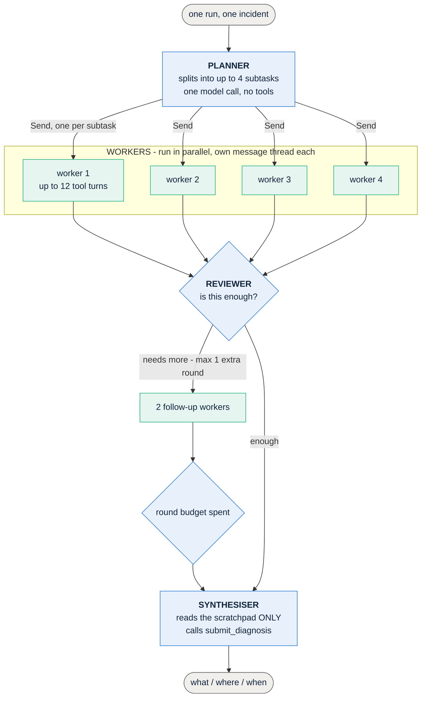
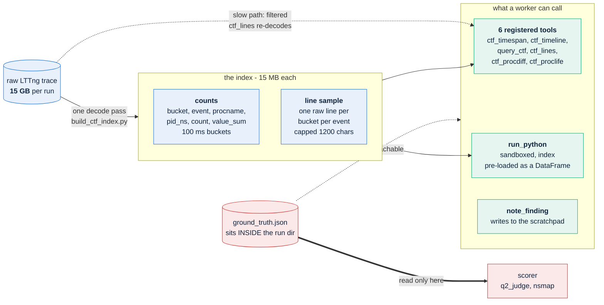
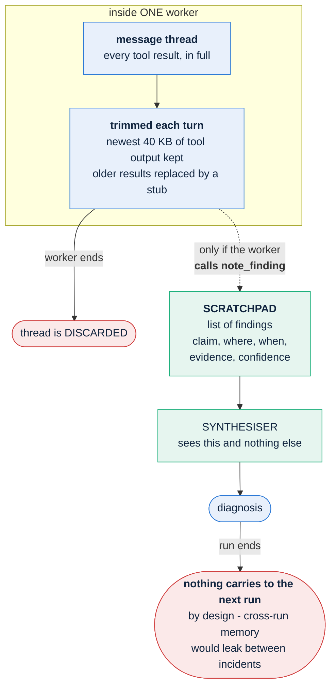

# How agent v2 works

Three diagrams: the flow, where the data comes from, and how memory works. Written 29-09-2026
against `agent_v2.py`, `ctf_tool.py`, `codetool.py`.

The one-line version: **a planner splits the job, up to four workers investigate in parallel
with their own tools, a reviewer decides whether to go again, and a synthesiser writes the
verdict from the findings the workers chose to record.**

---

## 1. The flow

**Limits, from the code:** `MAX_SUBTASKS = 4`, `MAX_WORKER_STEPS = 12`, `MAX_ROUNDS = 2`.

The workers never call `submit_diagnosis` — only the synthesiser does. And the synthesiser has
**no tools**: it cannot go and look at anything, it can only weigh what the workers wrote down.
That is deliberate, and it is also where the current bug lives. See section 3.

---

## 2. Where the trace comes in

The agent never touches the 15 GB trace directly. One decode pass turns it into two small files,
and everything the agent can do is a read of those.

**The ground-truth boundary is the rule the whole harness exists to keep.** `ground_truth.json`
lives in the same directory as the trace, so a tool handed a run path is one `open()` away from
the answer. `run_python` is therefore never given a run path at all — it gets a pre-loaded
DataFrame and no filesystem. The scorer reads ground truth; nothing the agent can call does.

**Two speeds.** Counts come from the index and answer in under a second. A `ctf_lines` call with
a `procname` or `contains` filter cannot be served from a one-line-per-bucket sample, so it falls
back to decoding the trace — 40 to 60 seconds. That is the right trade: slow and correct beats
fast and wrong.

**Every tool result is masked by `leakguard` before the model sees it**, and capped per tool
(`ctf_proclife` 45 KB, `ctf_procdiff` 24 KB, `ctf_lines` 18 KB, others 12 KB). Oversized results
are trimmed by dropping whole rows, never by slicing the JSON, and the model is told what was
dropped.

---

## 3. How memory works

There are three kinds, and they have very different lifetimes. This is the part worth
understanding, because the agent's most persistent failure lives here.

### The three kinds

| memory | scope | survives to | why |
|---|---|---|---|
| **message thread** | one worker | nothing | trimmed to 40 KB of tool output per turn, because a thread is re-sent every step and cost grows with the square of the turns |
| **scratchpad** | whole run | the synthesiser | the only thing that crosses the worker boundary |
| **cross-run** | — | **nothing, deliberately** | an agent that remembered incident 1 while diagnosing incident 2 would make later runs easier than earlier ones and break the independence the scores assume |

### The failure this design produces

**Anything a worker computes but does not write down is lost.** The synthesiser has no tools, so
it cannot go back and look.

Measured on the `dependency_outage` smoke run, 29-09. A worker ran exactly the right query:

| pid_ns | baseline/s | incident/s | ratio |
|---|---|---|---|
| **4026532822** | **1242.8** | **0** | **0.00** |
| 4026532751 | 86,597 | 44,477 | 0.51 |

That is the blueprint's deciding test passing exactly as written — lowest at 0.00, next at 0.51.
**It never became a finding.** Zero of nine findings mentioned that namespace, and the
synthesiser answered `normal`.

Two things went wrong at once, and both are properties of this design rather than of the model:

1. **A different worker filtered the answer away and recorded the exclusion as a fact.** It
   restricted to containers above a CPU floor, which excluded the silent container because it is
   small, then wrote the finding *"confirms no near-silent container"*. A tidiness filter became
   a claim the synthesiser had no way to check.
2. **The worker that got it right never called `note_finding`.**

This is the third time the agent has computed a discriminator and not acted on it — `svc_net`
and `svc_cpu_cap` were the first two, and both looked like answer-format problems at the time.

**The fix this points at:** a worker that runs code bearing on the blueprint's deciding test
should be required to record the result, whichever way it came out. Right now recording is
voluntary, and the synthesiser cannot tell the difference between "checked and found nothing"
and "never checked".

---

## What the agent is never told

Worth stating, because it is easy to assume otherwise:

- **not** that anything went wrong
- **not** when the incident was — finding the window is half the task and is scored separately
- **not** which service is the target
- **not** the fault name

It gets a run identifier that has been pseudonymised, the tools above, and — in the `given` arm
— one blueprint.
