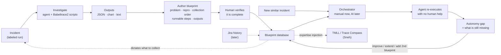

# Observability Blueprints — meeting summary + research idea

*Source: `meeting-notes/meeting-notes-26-08-2026.txt` (Naser Ezzati-Jivan, Mahsa Panahandeh,
Yuvraj Sehgal, Sneh Patel; 2026-08-26). Written 2026-08-26 on branch `new-agentic-architecture`.*

> Coverage: this merges two versions of the recording. The current file covers 0:00-10:36 and
> 13:22-end; the earlier version covered 10:36-13:22, folded in here. Effectively complete.
> Names in the auto-transcript are garbled: "CNN"/"Sienna"/"Sina"/"Tina" = Ciena,
> "test compass" = Trace Compass, "bubble trace" = Babeltrace, "LTNG" = LTTng, "scales" = skills,
> "candle level" = kernel-level.

---

## 0. Action items (with a deadline)

| # | Action | Owner | When |
|---|---|---|---|
| 1 | **Come up with the structure / format for the blueprint** | Yuvraj | now — Naser asked for this explicitly |
| 2 | Take **one simple problem** end to end and produce a **draft blueprint** | Yuvraj | **"by tomorrow"** (2026-08-27) |
| 3 | Check the blueprint with Naser — "I will tell you if it is good enough" | Naser | after 2 |
| 4 | Send his existing blueprint draft (a big JSON, AI-assisted, made for a Ciena meeting, not tied to a real problem) | Naser | pending |
| 5 | Read the brainstorming chat already shared (voice + written) | Yuvraj | pending |
| 6 | Grow to ~**five problems** with blueprints, to show Ciena "next time" | Yuvraj | after 2-3 |

Yuvraj committed in the call to "at least one or two blueprints, and evaluate them".

Note on Naser's JSON draft: it was written from experience for a meeting, **not** from a real
problem. His words: *"you should change it... now we are in the implementation stage, we might want
to customise it, change it, add to it."* So it is a starting shape, not a spec to obey.

---

## 1. The idea in one paragraph

Every trace analysis system is **input to analysis to output**. Today each investigation runs that
pipeline once and the experience is thrown away. The proposal: capture the *whole* experience of
solving one problem — what data to collect, what analysis to run, what output to produce — as one
self-contained document: an **observability blueprint**. Blueprints accumulate into a database.
When a similar problem appears, the database already has the prescription. Because a blueprint is
written to be executed, an AI agent can read it and redo the investigation without a human. That
makes the architecture **AI-agent-friendly**, and the database becomes a **knowledge base for
trace-analysis agents**.

**Terminology:** use **blueprint**, not "template" — Naser's explicit preference ("a better term").

---

## 2. Why — the motivation, and what we are selling

> **"This is the part that we are selling to Ciena — the blueprint part."**

Everyone already has a trace analysis pipeline. Collect data, look at logs, analyse, done. The
argument is that this is not enough, because nothing accumulates.

**The expert-knowledge problem.** The tool teams (François, Mohammed, Jason, Alex) solve huge
kernel-level problems — each one could be a paper. **But there is no history. The history is in
Mohammed's brain.**

> "How do you resolve this? Oh, let me check. Oh, I remember I had this problem, but I had to
> remove it because I didn't have enough disk space." So they remove part of the history from
> their system.

> "So we are training another expert like Mohammed with this framework. Not only Mohammed — Jason
> works on a problem, Mohammed works on a problem, Alex works on a different problem. We collect
> all of them together. So the expert we're training will have the knowledge of all of those
> engineers."

**Relation to Jira.** Companies already keep Jira histories. A blueprint is *an enriched Jira
history*:

> "Most companies have a list of Jira histories, but now we are enriching that — adding more
> details to those histories. We include problems, solution, and everything else, because AI
> agents will be able to use this. **Making this AI-agent friendly was not there. This is what we
> are adding to our architecture.**"

**The intuition, from Naser's own experience with AI tools** (this is the mechanism in miniature):

> "Every time, AI tries to invent something. I have the workflow and everything, but it does not
> use it. Once I asked it: don't create anything new, just document what we have done for this
> project. So we fully documented the whole thing — **I checked the documentation myself, made
> sure everything is there.** Next time, I say: first read that document, digest it, then these
> are the inputs, let's create the video. This time it does it much better, faster, more accurate,
> better quality. **Sometimes I forget to mention that document — and again it tries to download a
> 50 GB model from Hugging Face and reinvent the workflow.**"

Two things follow: (a) without the document the agent reinvents and wastes; (b) **a human verifies
the blueprint before it is trusted** — that is part of the loop, not an afterthought.

---

## 3. Meeting summary

### 3.1 The base architecture

| Layer | What it is |
|---|---|
| **Input** | Telemetry collection — traces, logs, metrics, kernel. Traditional or adaptive. Same shape as the OpenTelemetry pipeline. |
| **Analysis** (green) | A list of processes: aggregation, mining, correlation, ML. |
| **Output** | Charts, timelines, text, JSON — whatever explains the finding. |
| **Tools** (purple) | MCP plus user-facing tools: Trace Compass (including TMLL and Sneh's work), Racoon Miner, dashboards. |

François's point, repeated by Naser: **Trace Compass is only a small part of this framework**, not
the framework itself.

### 3.2 The new layer: blueprints

Take one solved problem — the collection, the analysis, the output, all of it — and write it down.
The comparison used in the call: like bug documentation, but Bugzilla only documents the bug.
**A blueprint documents the bug and the solution.**

A blueprint holds:

1. **Problem definition** — a *specific* situation, not a generic fault class.
2. **Reproduction** — how to regenerate it: which system, which machine, which OS, what to run.
3. **Data requirements** — the exact events. "It cannot be general, it has to be very detailed."
4. **Processing steps** — the pipeline, step by step, each step linked to code / folder / library.
5. **Output spec** — the report, XY chart, timeline, or JSON the problem should produce.
6. **Links** — every step points at a real file.

> "That document will link to the code and data and everything else."

**Sequencing (explicit):** *"We will turn it to skills later on, but for now we just need a
template."* Blueprint document first. Skill format second.

### 3.3 Blueprints also drive collection — not just analysis

> "Someone comes to me: there is a problem in this part of the system. I ask them, we need data.
> But what data? I don't know. Those blueprints can tell me: this looks like a latency problem. We
> have a skill that says for this problem we need **5 kernel events, 3 telemetry data**. So those
> blueprints can even dictate what data to collect."

Then, once data exists, the blueprint says which analysis to run — "think about 100 different
analyses; we already have a good pipeline and list in those blueprints."

So a blueprint closes the loop back to the **input** layer. It is a collection order, not only an
analysis recipe.

### 3.4 Blueprints as expertise for TMLL

TMLL (Sneh's area) has data sources and views. Someone asks "why is this slow?", TMLL walks the
views, uses RAG, analyses the trace.

> "But there's a big thing missing here: the intelligence, the skill, **the expertise on trace
> analysis**. TMLL every time needs to understand — what is this trace? what's that event?"

With a blueprint library, TMLL can say "there are 5 examples of these problems in my blueprint
history — let me see how they solved it." Naser called it **injecting expertise into TMLL** so it
does not analyse from scratch every time, using successful examples created by humans. Faster,
easier, more accurate — and useful to human analysts too.

### 3.5 Scope instruction

> "You need to implement this whole framework — but not all of it, because all of it needs two or
> three years. Implement a layer: part of each part."

Build a **thin vertical slice** — one input modality, one small analysis, one interface — end to
end.

- Interface: **Babeltrace2 command line**, not Trace Compass (Trace Compass is Sneh's area).
- Analysis: a list of C or Python scripts on the input data.
- Output: XY chart, timeline, JSON, or text explaining the root cause.

And directly to Yuvraj:

> "**Work issue-based.** Find one issue, one problem, collect data, do the analysis, then write it
> down in the blueprint, and check it with me... but you need to **come up with a structure, a
> format for the blueprint**."

> "This time it's going to be **problem focused**. Choose one problem, one fault, one issue. We
> don't have any blueprint yet. Ciena doesn't know it yet, because this is my contribution."

**The task is not RCA-only:** *"Your work now will be finding issues that you can detect. It can be
detection, it can be root cause analysis, it can be other kinds of analysis too."*

### 3.6 Where our current work fits

Naser reviewed the existing design (`new_design.md`) and placed the Jira work inside it:

- The Jira block in the diagram is the Jira **for that issue** — not historical Jira.
- **Related Jiras** (the blue box under it) sit in the Investigation Context Builder / Shared
  Investigation Context. That work fits, unchanged.
- *"But the one thing missing from there is the blueprint. We have not turned it into any
  blueprint."*
- *"You injected four or five problems before and your system was able to detect them. Do that —
  but then turn the whole experience of detecting a problem into a blueprint."*

So the architecture is accepted. **The blueprint is the delta.**

### 3.7 On reusing published work (Yuvraj's question)

Yuvraj: hundreds of RCA and ML papers exist. Take their **conclusions** into the skill — e.g.
"this syscall is 90% predictive for CPU problems" — instead of redoing the work.

Naser: learning from papers is fine. But **generate the trace / log / telemetry data ourselves**,
and write our own analysis code producing the outputs those papers suggest.

Mahsa added the condition: extracted approaches **must be tested on our own data** to confirm they
generalise to our domain and scope.

### 3.8 The headline experiment: with versus without blueprints

Naser stated the evaluation directly:

> "We can compare with and without — AI trace analysis, AI agents, **with and without those
> blueprints**. And you should be able to see a huge difference."

Yuvraj added the second axis: **time** — can it do the RCA faster, not just better.

### 3.9 The validation loop (the research method)

1. Solve a problem by hand. Document it as a blueprint. **A human checks the blueprint is complete.**
2. Regenerate a **similar but not identical** problem.
3. Hand only the blueprint to the AI. Let it redo the whole thing with no human help.
4. Measure the gap. Maybe it gets 80% and misses 20%.
5. Improve the blueprint — or add an extension, or a **second blueprint** it can call.
6. Repeat.

Eventually an agent component does the lookup itself: *"link the current problem to those past
problems, find the relevant skill, and use it for the detection."*

### 3.10 Skill selection: manual now, automatic later

> "We can give **one main and a couple of others, similar ones**. That part we will do manually,
> but later AI will choose the most relevant skill for that given problem. But you need a good
> database first."

"One main plus a couple of similar ones" is exactly a distractor condition — it matches the S1/S2
design we already run.

### 3.11 Mahsa: put the actual code in the skill

This is her most concrete contribution, and it is a validated finding, not a suggestion:

> "Even in the skill you could add some parts of the code of the analyser... it should be tested on
> your own data to make sure it generalises to your domain. But **referring to that code in the
> skill increases the accuracy and decreases the non-determinism** of the LLM. When you say 'I have
> this RCA code, and if you see these symptoms go for it and run this one', that still has a level
> of non-determinism. **But if you put the exact function in the skill, it reduces that and
> increases accuracy a lot. We did it in three different industry domains and it worked a lot.**"

**Design rule:** the `processing` steps must carry the **exact callable** — a command line, a
script path, a function reference — not a prose description of what to do.

### 3.12 Orchestration (Mahsa)

- An **orchestrator** is needed to pick blueprints — and the orchestrator itself needs a template.
- Autonomous skill selection works when the problem is easy (read a file, open a spreadsheet). On
  hard problems, other projects show it does **not** work well.
- Escalation: for one fault type (CPU exhaustion / contention), decide when you want two skills
  versus one merged skill. Similar past Jira cases can decide which to start from.
- Known bias: with a simple skill and a RAG-based complex skill both available, the orchestrator
  usually picks **the complex one**. The assumption that the simplest is tried first is wrong.
  Mahsa is writing an empirical study on agent behaviour in RCA and repair.

### 3.13 Human in the loop

> "We are not fully replacing analysis. The tool helps the analysts. But **every time they run
> this, they add to the blueprint, they improve it**. Eventually we'll have something that does
> most of the work."

Later the analysis layer becomes two-part — human or AI — and eventually runs mostly by AI, because
it has enough skills.

### 3.14 Bootstrapping from Jira

Mine **Jira history** to build a first blueprint repository — extract how the team actually solved
past CPU-contention tickets — then add our own analyses on top.

### 3.15 What is new versus published work

> "All papers talk about: we got this data, we did this analysis, look how good our result is. Now
> we come with a new architecture that learns from the experiment, from history, and develops a
> full, capable skill that can redo the same problems later on."

> "Compared to the paper we discussed before... they don't have this history part. They're missing
> this part. So we are actually coming up with a new architecture."

The research output is not an accuracy number. It is a **reusable, executable artifact**, plus
evidence that an agent can run it unaided.

---

## 4. Blueprint format (draft — action item 1)

One file per blueprint. Frontmatter machine-readable; body is what the agent reads. Markdown with
YAML frontmatter is proposed (Naser's own draft is JSON — worth reconciling once it arrives; JSON
is easier for tools to consume, markdown is easier for humans to author and review).

```markdown
---
name: cpu-contention-rca
version: 1
authored_by: human | mined:<transcript|jira ref>
verified_by: <human who checked it is complete>          # see 2 — verification is part of the loop
problem:
  summary: "one specific situation, not a generic fault class"
  symptoms: ["p99 latency up on callers", "callee is resource-quiet"]
reproduction:                       # how to regenerate it
  system: "Sock Shop on Ubuntu 24.04, LTTng 2.15, Docker 27, GCP n2"
  recipe: microservice-lttng-data-collection-scripts/faults/<recipe>.sh
  intensity: "..."
collection_order:                   # what to COLLECT — the blueprint dictates this
  kernel_events: [sched_switch, sched_wakeup, sched_migrate_task, ...]   # exact, ~5
  telemetry: [container_cpu_usage_seconds, cfs_throttled_seconds, ...]   # exact, ~3
  window: "baseline 5 min, incident 5 min"
processing:                         # EXACT callables, not prose (Mahsa's rule, 3.11)
  - step: "extract off-CPU and runqueue-delay intervals"
    run: "babeltrace2 <trace> | python3 scripts/rq_delay.py --out rq.json"
  - step: "attribute wait time to a service via the PID map"
    run: "python3 scripts/attribute_pid.py rq.json meta/containers.json"
outputs:                            # what to generate / regenerate
  - kind: json        # machine verdict
  - kind: xy_chart    # runqueue delay over time
  - kind: text        # root-cause explanation
evidence_from_literature:           # 3.7 — cite it, but validated on our data
  - claim: "..."
    source: "..."
    validated_on: "<our runs>"
related_blueprints: [service-cpu-throttle-rca]
---
## Investigation blueprint
1. ...
## Resolution template
- ...
```

Difference from our current `agentic-rca/skills/*.md`: those carry problem_signature /
investigation_blueprint / resolution_template as **prose only**. A blueprint adds **reproduction**,
an exact **collection order**, **runnable commands per step**, and an **output spec**.

---

## 5. The research idea

**Claim.** Trace analysis should accumulate. A finished investigation should leave behind an
executable blueprint, and a library of blueprints should let an agent solve the *next* similar
problem on its own — faster, and more accurately.

**Research questions.**

| RQ | Question | How we answer it |
|---|---|---|
| RQ1 | **With versus without blueprints** — the supervisor's headline. Does the agent do better with the blueprint? | Same incidents, same tools, blueprint on/off. Accuracy **and** time / tool calls / tokens / cost. |
| RQ2 | Can a blueprint written from one incident solve a **similar new** incident with no human help? | Author on run A, test on run B (other service, other intensity, then other app). Measure the autonomy gap. |
| RQ3 | Does a blueprint beat a good deterministic brief? | Our model-only brief control (21-08) already ties the 7-tool agent. The blueprint must beat *that*, not a strawman. |
| RQ4 | Does the library help on **never-seen** faults, or do wrong blueprints mislead? | Leave-one-family-out (S2) — designed and run once already. |
| RQ5 | Does **exact code in the blueprint** beat a prose description of the same step? | Mahsa's finding, replicated in our domain: run both variants, measure accuracy and run-to-run variance. |
| RQ6 | Does a blueprint's **collection order** cut the data needed without losing accuracy? | Our degradation ladder already measures accuracy versus telemetry volume. Asking for 5 events instead of a full kernel trace is directly testable. |
| RQ7 | Can the orchestrator pick the right blueprint from evidence alone? | Selection precision, abstention recall, false-match confusion; test the complex-skill bias. Manual selection is the baseline (3.10). |
| RQ8 | Can blueprints be **mined** rather than hand-written? | Mine from our own RCA transcripts, later from Jira. Compare mined versus hand-authored. |

RQ5 and RQ6 are ours to answer better than anyone: RQ5 because we have a leak-audited harness and
can measure variance, RQ6 because we have the kernel ladder.

**Novelty.** Prior work reports accuracy on a pipeline. Here the deliverable is a *transferable
artifact*, and its reuse is the measurement. The blueprint also feeds back into collection, which
no RCA paper does.

---

## 6. What we already have versus what is missing

| Blueprint part | Status in this repo |
|---|---|
| Problem definition per fault | **Have** — `fault_catalog.md` cards, 12 families |
| Reproduction recipe | **Have** — `microservice-lttng-data-collection-scripts/faults/` plus ground-truth state files |
| Data (self-generated, labeled) | **Have** — 95 incidents, 4 modalities plus kernel L0-L3, audited |
| Investigation and resolution prose | **Have** — 12 lint-clean skills in `agentic-rca/skills/` |
| Executing agent and tools | **Have** — `agent.py`, `tools.py`, leakguard, transcripts |
| Cost / time measurement | **Have** — tokens, calls, $ per incident already per-row (RQ1's second axis) |
| Jira / related-Jira context | **Design accepted, not built** — no corpus, no retrieval |
| Selector / orchestrator | **Partial, currently net-negative** — meeting says manual is fine for now |
| Exact event-level collection order | **Missing** from the skill files |
| Runnable commands per step | **Missing** — this is Mahsa's point, and it is the biggest single gap |
| Output spec (chart / JSON / report) | **Missing** — we emit a verdict, not an artifact set |
| Babeltrace2 CLI analysis scripts | **Missing** — kernel work goes through Python tools today |
| Mining loop (transcript to blueprint) | **Missing** |

Honest note: on 21-08 we measured that a **one-shot model call with a good deterministic briefing
ties the full tool-using agent** (78% / 52% both ways, at 27% of the tokens). A blueprint has to
earn its place against that control. That gives RQ3 a real baseline instead of an easy one — and it
is also encouraging for this direction, since it says *good up-front structure* is what works,
which is exactly what a blueprint is.

---

## 7. The first blueprint (due tomorrow)

Per 3.5: **one problem, one fault, one blueprint.**

| Layer | Slice |
|---|---|
| Problem | **CPU contention** — Naser's running example throughout the meeting |
| Input | **Kernel trace only** (LTTng CTF), a named event list, not the whole trace |
| Tool | **Babeltrace2 CLI** plus small Python scripts (no Trace Compass) |
| Analysis | Off-CPU and runqueue-delay attribution per service, baseline versus incident |
| Output | JSON verdict, one XY chart, one text explanation |
| Blueprint | One file, format from section 4, every step a runnable command |
| Agent | Existing `agent.py`, but the blueprint supplies the steps |

We already have labeled CPU-contention runs, so step 1 is mostly *documenting what we already do*
in the blueprint format — which is exactly what Naser did with his own AI workflow (section 2).



---

## 8. Open questions

1. **Does this replace the MSR paper track, or run beside it?** The dataset and ablation paper has
   an abstract due **Nov 5, 2026**. Blueprints are a second story and must not eat that deadline.
   This needs an explicit call.
2. **JSON or markdown?** Naser's draft is JSON; our skills are markdown. Pick one and say why.
   (Suggestion: markdown body with structured frontmatter, and emit JSON from it.)
3. **What counts as "similar but not identical"?** Same family different service? Different
   intensity? Different app? Fix the ladder before measuring, and pre-register it the way
   `fault_catalog.md` is pre-registered.
4. **How is the autonomy gap scored?** Percent of blueprint steps executed unaided is easy but
   shallow. Correct verdict plus correct output artifacts is stricter. Probably both.
5. **Which five problems?** Naser wants ~5 blueprints to show Ciena. Which five, and do they span
   fault groups or drill into one?
6. **Blueprint composition** — how does one blueprint call another? An explicit
   `related_blueprints` list plus an escalation rule, or left to the orchestrator?
7. **TMLL handoff** — if Sneh's TMLL consumes the blueprint library, the format has to be agreed
   with Sneh, not designed alone.
8. **Evaluation integrity** — a blueprint that names the fault is a hint channel. The existing
   leakage discipline (masking, service-agnostic lint, LOFO) must extend to the new fields,
   especially `reproduction` and `collection_order`.

---

## 9. Next steps

1. **Freeze the blueprint format** (section 4). This is action item 1 and blocks everything else.
2. **Build the first blueprint end to end** on a CPU-contention incident — real event names,
   runnable commands, generated outputs. Draft due tomorrow.
3. Write the **Babeltrace2 CLI path** for that family, so the steps run outside the Python tools.
4. Run the 3.9 loop once on a held-out CPU incident. Record exactly what the agent could not do
   alone.
5. Show Naser the blueprint plus the measured gap; get the format signed off before scaling.
6. Reconcile with Naser's JSON draft when it arrives.
7. Then: RQ1 (with/without) on a handful of incidents — cheap, and it is the number he wants.

*Related docs: `new_design.md` (as-built architecture, open questions Q1-Q8),
`agentic-rca/RESULTS-v4-campaign.md` (skills S0/S1/S2 results),
`agentic-rca/RESULTS-review-items.md` (the model-only control), `fault_catalog.md`.*
