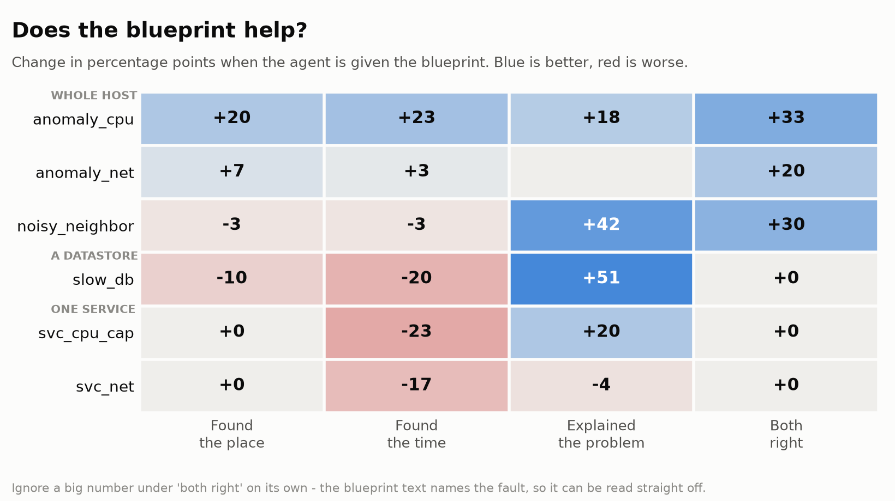
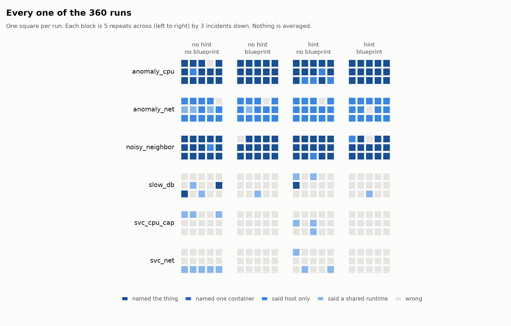
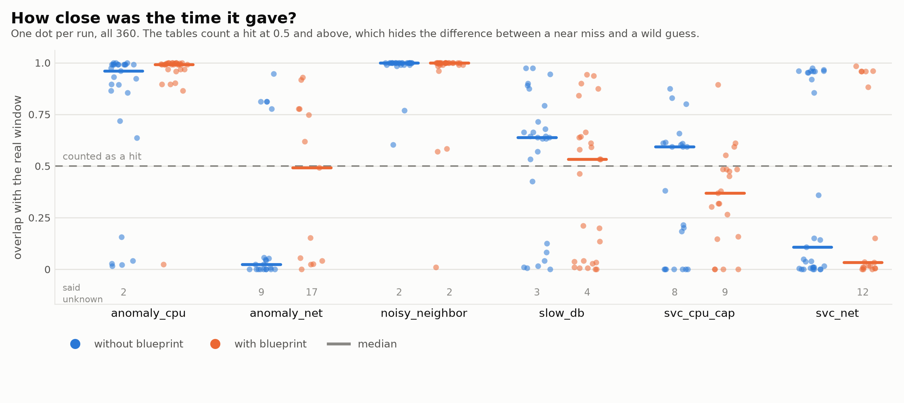
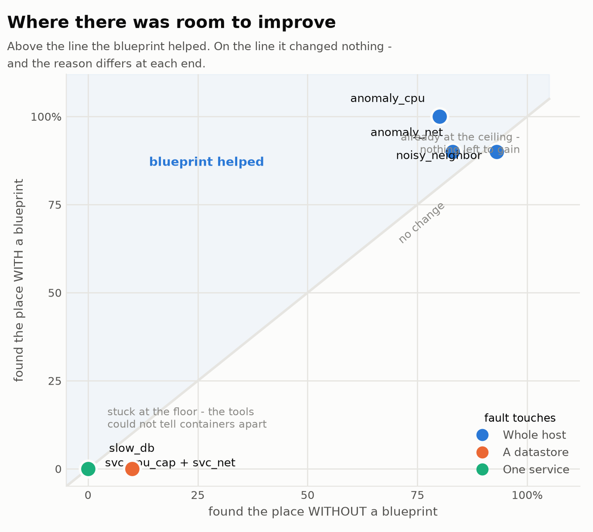
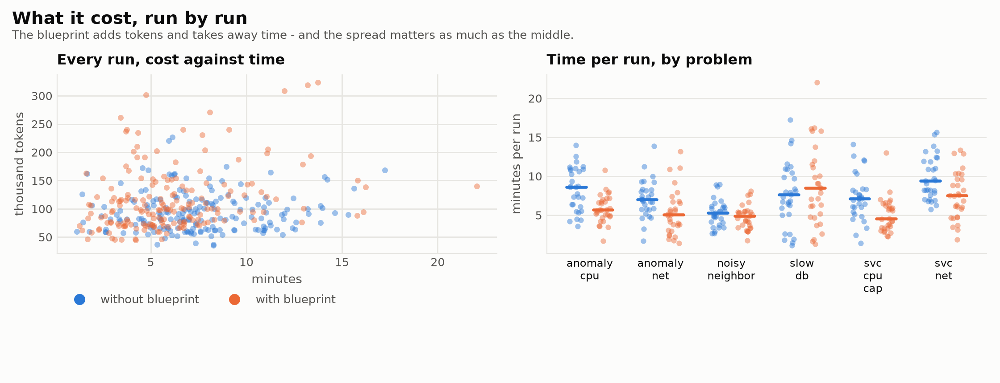

# Train Ticket results - 22 September 2026

Every run of the blueprint study in one place. Generated by `blueprints/lib/q2_onefile.py` from the run files, so it cannot drift from them.

## What was run

| | |
|---|---|
| problems | 6 |
| runs per problem | 3 incidents x 2 arms x 2 asks x 5 repeats = 60 |
| total | **360 runs, 0 failed** |
| evidence | kernel traces only. No metrics, no logs, no spans |
| model | `gpt-5.4-mini` (azure) |
| blueprint | handed over, not chosen |
| application | **Train Ticket** |
| results | `/scratch/yuvraj17/stratatrace/results/q2-tt` |
| `anomaly_net` | **taken from `/scratch/yuvraj17/stratatrace/results/q2-net-tt`** (60 runs) - the matrix cells for it were run against a false kernel recipe, see WHEN-A-BLUEPRINT-HURTS.md |

The agent is never told when the fault was, or that there was one. It gets six read-only tools over the raw kernel trace and has to find what happened, when, and where.

## How to read the tables

Every problem below has the same table. This explains it once.

### The rows

Each row is one setup. The name has two parts, split by a `|`.

**Part 1 - did we give the agent a hint?**

- `nohint` - we said nothing at all. It gets a trace and works out the rest.
- `hint` - we told it the symptom only. Something like "requests are slow and the host looks contended". Never the answer.

**Part 2 - did we give the agent the blueprint?**

- `none` - no blueprint. It works alone.
- `given` - we handed it the right blueprint to follow.

So `nohint | none` is the least help and `hint | given` is the most. Each row is run 15 times, so a lucky answer does not look like a skilled one.

### The columns

| column | the question it asks |
|---|---|
| n | how many runs. Always 15 |
| both right | did it get the place AND the fault name right |
| WHERE | did it point at the right thing |
| window | did it find the right time |
| described | how much of the problem its own words explained |
| fault | did it pick the right fault name from our list |
| time | how long one run took |
| tokens | how much one run cost |

**WHERE and both right are not the same.** `both right` needs the fault name too. `WHERE` only asks about the place.

> **Ignore the `fault` column when comparing rows.** The blueprint text describes the fault, so a `given` row can read the answer straight off it. That column mostly shows whether the agent read the page. To measure it properly we need a setup where the agent picks its own blueprint from all 11.

## How we score each answer

Each run is scored on its own. The column is then how many of the 15 passed.

The agent never sees the right answer. Only the scorer reads it, after the run is finished.

### both right

The strictest test. It must get the place right AND the fault name right. Pass or fail.

### fault

Did the fault name it picked match the one we injected? We match on meaning, not spelling, so `cpu_saturation` and `anomaly_cpu` count as the same thing.

### WHERE

Not just right or wrong. There are five kinds of answer:

| answer | what it means |
|---|---|
| named | it said the exact thing we broke, like `stress-ng-cpu` |
| container | it said one exact container, using its `pid_ns` number |
| host only | it said `host`, and nothing smaller |
| ambiguous | it said `java`. Five containers here run java, so this is vague |
| wrong | anything else |

**Which of these count as right depends on the fault.**

For most faults there is one container at fault, so the agent should name it. Saying `host` is a safe guess and does not count.

`anomaly_net` is the exception. We slowed the host's own network card. There is no container to name, so `host` **is** the full answer and it counts.

The right answer for each run is read from that run's own record. We never typed a list of expected answers by hand.

### window

We compare the time range it gave against the real one.

```
overlap = the time both ranges share
union   = the time they cover together
score   = overlap / union
```

A score of 1.0 means the ranges match exactly. A score of 0 means they do not touch.

| verdict | when |
|---|---|
| hit | score is 0.5 or higher |
| partial | they overlap a bit, but less than that |
| miss | they do not overlap |
| abstained | it answered `unknown` |

The table counts hits only.

**Answering `unknown` is not counted as wrong.** We told the agent that a made-up time is worse than saying it does not know. Marking it wrong would punish it for doing what we asked.

### described

This is a word check, and it is the softest number here.

For each problem we wrote down 3 ideas that a correct answer contains. For `noisy_neighbor` they are:

1. there is an extra workload that is not part of the app
2. it is taking CPU away from the others
3. the app services are victims, not the cause

Each idea has a list of words and phrases that count. Any one of them scores that idea. So hitting 2 of 3 gives 67%%.

It asks "did the agent say this at all", not "did it say it well". A low score means go and read the run. It does not prove the run is wrong.

We got this wrong the first time. Our word list held a bare "db", which appears in `catalogue-db`. So any answer naming that container scored a free point, and `slow_db` came out at 97%%. It now asks for real phrases like "database" or "waiting on".

### time and tokens

The middle value of the 15 runs, not the average. One very slow run cannot drag the number.

## The results in five charts

Generated by `blueprints/lib/q2_charts.py` from the same run files as the tables below. Three of the five show **every single run** rather than an average, because averaging 360 runs down to 24 numbers hid things worth seeing.

### 1. Where the blueprint helps, and where it hurts



Rows are grouped by what the fault touches: **whole host** at the top, a **datastore** in the middle, **one service** at the bottom.

The blueprint helps most at explaining the problem - +44 on `noisy_neighbor`, +29 on `slow_db`. It does nothing for finding the place on three problems, and the reasons are opposite (chart 4). On `anomaly_net` it makes finding the time **37 points worse**, which is our own fault and is explained at the end.

### 2. Every one of the 360 runs



One square per run. Each block is 5 repeats across by 3 incidents down. Nothing is averaged, so you can see how steady each result is.

A percentage cannot tell a steady 3-out-of-5 from 5-out-of-5 on one incident and 0-out-of-5 on the next. Here it is visible. `anomaly_cpu` is solid dark across all 60 runs - never once wrong. `svc_net` is almost solid grey. And the third row of `slow_db` is grey in every arm, which says one of its three incidents is harder than the other two - something no column of averages would ever show.

### 3. How close was the time it gave?



Every run's overlap score, not the pass rate. This is the chart that changed what we think.

**The scores are in two clumps, near 1.0 or near 0, with almost nothing between.** The agent either finds the window almost exactly or misses it completely. It does not produce rough answers.

That matters for two reasons. The 0.5 cut we chose is not arbitrary after all - it falls in an empty gap between two real groups. And "it was close" is not a thing that happens here, so a miss is always a miss and worth reading.

The `anomaly_net` damage is visible too: without the blueprint the runs sit high, with it there are 14 grey `unknown` answers instead.

### 4. Why the blueprint changes nothing on three problems



Points above the line are where the blueprint helped. Points **on** the line are where it changed nothing - and the two ends mean opposite things.

`anomaly_cpu` sits top right at 100%% in both arms. Nothing left to gain. `svc_cpu_cap` and `svc_net` sit bottom left at zero in both arms, because our tools could not tell one container's `java` from another's. A blueprint cannot rescue a question the evidence cannot answer.

**Same number, opposite meaning.** That is why we never report an average across problems - it came out as +0 and told us nothing.

### 5. What it cost, run by run



The left panel is all 360 runs on cost and time. The clouds overlap almost completely, so the neat median difference in the tables is a small shift inside a very wide spread - runs range from 30k to 230k tokens on the same problem.

The right panel is clearer: with the blueprint the agent is **faster** on every problem. It costs more to read and saves more than it costs by not casting about.

---

## All six problems at a glance

| problem | target | WHERE right | window hits | described |
|---|---|---|---|---|
| slow_db | `mysql` | **3/60** | 32/60 | 61% |
| anomaly_net | `host` | **52/60** | 11/60 | 92%* |
| svc_net | `ts-basic-service` | **0/60** | 17/60 | 36% |
| noisy_neighbor | `host` | **55/60** | 55/60 | 64% |
| svc_cpu_cap | `ts-travel-service` | **0/60** | 15/60 | 36% |
| anomaly_cpu | `host` | **54/60** | 51/60 | 87% |

The split is by **scope**, not by difficulty. Host-wide faults are found. Single-service faults are not.

**Why, and it differs by application - measured, not assumed.** A kernel trace identifies a container by `pid_ns` and a process by its 15-character `comm`. Neither carries a SERVICE name, so an agent can point at a container and still not be able to say which service it is.

| | containers | what the services look like |
|---|---|---|
| Sock Shop | 21 | 5 containers all called `java` - the name alone is ambiguous |
| Train Ticket | 48 | JVM **thread** names: `http-nio-12346-`, `reactor-http-ep`, `grpc-nio-worker`, `org.springframe` |

Train Ticket's trace is the RICHER of the two - `http-nio-12346-` even carries the service's port - and it still scored 0/60. So this is not simply "the process name is too vague". Mapping either a namespace or a thread name to a service needs the deployment config, which is not in the trace.

---

## slow_db

Target: `mysql`. Best WHERE answer this fault allows: **name the container**.

| ask \| arm | n | both right | WHERE | window | described | fault | time | tokens |
|---|---|---|---|---|---|---|---|---|
| nohint \| none | 15 | 0% | 13% | 60% | 18% | 0% | 7m36s | 66,663 |
| nohint \| given | 15 | 0% | 0% | 47% | 91% | 93% | 7m08s | 126,979 |
| hint \| none | 15 | 0% | 7% | 67% | 53% | 0% | 7m19s | 91,117 |
| hint \| given | 15 | 0% | 0% | 40% | 82% | 73% | 8m28s | 124,651 |

Blueprint effect, in percentage points:

| ask | both right | WHERE | window | described | fault |
|---|---|---|---|---|---|
| nohint | +0 | -13 | -13 | +73 | +93 |
| hint | +0 | -7 | -27 | +29 | +73 |

Where it pointed, all 60 runs: named the thing **3**, one container **0**, host only **0**, a shared runtime like `java` **6**, wrong **51**. It answered `host` 26 times.

Most common answers: `host` 26, `http-nio-12031-` 7, `HikariPool-1 co` 5, `http-nio-18888-` 3, `connection` 3, `toxiproxy` 3

---

## anomaly_net

Target: `host`. Best WHERE answer this fault allows: **say `host`**.

| ask \| arm | n | both right | WHERE | window | described | fault | time | tokens |
|---|---|---|---|---|---|---|---|---|
| nohint \| none | 15 | 0% | 73% | 20% | 93%* | 0% | 7m25s | 101,663 |
| nohint \| given | 15 | 33% | 87% | 33% | 87%* | 33% | 4m55s | 84,893 |
| hint \| none | 15 | 7% | 93% | 13% | 100%* | 7% | 6m56s | 94,456 |
| hint \| given | 15 | 13% | 93% | 7% | 90%* | 13% | 5m04s | 113,589 |

Blueprint effect, in percentage points:

| ask | both right | WHERE | window | described | fault |
|---|---|---|---|---|---|
| nohint | +33 | +13 | +13 | -7 | +33 |
| hint | +7 | +0 | -7 | -10 | +7 |

Where it pointed, all 60 runs: named the thing **0**, one container **0**, host only **52**, a shared runtime like `java` **4**, wrong **4**. It answered `host` 51 times.

Most common answers: `host` 51, `toxiproxy` 3, `python3` 3, `prometheus` 1, `node-MainThread` 1, `python` 1

---

## svc_net

Target: `ts-basic-service`. Best WHERE answer this fault allows: **name the container**.

| ask \| arm | n | both right | WHERE | window | described | fault | time | tokens |
|---|---|---|---|---|---|---|---|---|
| nohint \| none | 15 | 0% | 0% | 33% | 38% | 0% | 9m26s | 81,923 |
| nohint \| given | 15 | 0% | 0% | 27% | 33% | 0% | 7m34s | 100,456 |
| hint \| none | 15 | 0% | 0% | 40% | 38% | 7% | 9m02s | 91,019 |
| hint \| given | 15 | 0% | 0% | 13% | 33% | 13% | 7m27s | 81,296 |

Blueprint effect, in percentage points:

| ask | both right | WHERE | window | described | fault |
|---|---|---|---|---|---|
| nohint | +0 | +0 | -7 | -4 | +0 |
| hint | +0 | +0 | -27 | -4 | +7 |

Where it pointed, all 60 runs: named the thing **0**, one container **0**, host only **0**, a shared runtime like `java` **8**, wrong **52**. It answered `host` 41 times.

Most common answers: `host` 41, `java` 7, `toxiproxy` 4, `connection` 3, `com.alibaba.nac` 2, `python3` 1

---

## noisy_neighbor

Target: `host`. Best WHERE answer this fault allows: **name the container**.

| ask \| arm | n | both right | WHERE | window | described | fault | time | tokens |
|---|---|---|---|---|---|---|---|---|
| nohint \| none | 15 | 47% | 93% | 93% | 36% | 47% | 5m28s | 112,356 |
| nohint \| given | 15 | 93% | 93% | 93% | 89% | 93% | 3m41s | 113,238 |
| hint \| none | 15 | 73% | 93% | 93% | 51% | 73% | 4m51s | 93,709 |
| hint \| given | 15 | 87% | 87% | 87% | 82% | 93% | 5m19s | 148,311 |

Blueprint effect, in percentage points:

| ask | both right | WHERE | window | described | fault |
|---|---|---|---|---|---|
| nohint | +47 | +0 | +0 | +53 | +47 |
| hint | +13 | -7 | -7 | +31 | +20 |

Where it pointed, all 60 runs: named the thing **55**, one container **0**, host only **3**, a shared runtime like `java` **0**, wrong **2**. It answered `host` 3 times.

Most common answers: `stress-ng-cpu` 55, `host` 3, `toxiproxy` 1, `unknown` 1

---

## svc_cpu_cap

Target: `ts-travel-service`. Best WHERE answer this fault allows: **name the container**.

| ask \| arm | n | both right | WHERE | window | described | fault | time | tokens |
|---|---|---|---|---|---|---|---|---|
| nohint \| none | 15 | 0% | 0% | 33% | 9% | 0% | 6m57s | 92,667 |
| nohint \| given | 15 | 0% | 0% | 13% | 47% | 73% | 4m14s | 94,355 |
| hint \| none | 15 | 0% | 0% | 40% | 42% | 0% | 7m12s | 81,988 |
| hint \| given | 15 | 0% | 0% | 13% | 44% | 67% | 5m40s | 95,371 |

Blueprint effect, in percentage points:

| ask | both right | WHERE | window | described | fault |
|---|---|---|---|---|---|
| nohint | +0 | +0 | -20 | +38 | +73 |
| hint | +0 | +0 | -27 | +2 | +67 |

Where it pointed, all 60 runs: named the thing **0**, one container **0**, host only **0**, a shared runtime like `java` **6**, wrong **54**. It answered `host` 48 times.

Most common answers: `host` 48, `python3` 4, `unknown` 2, `kworker/u64:15` 1, `java` 1, `python` 1

---

## anomaly_cpu

Target: `host`. Best WHERE answer this fault allows: **name the container**.

| ask \| arm | n | both right | WHERE | window | described | fault | time | tokens |
|---|---|---|---|---|---|---|---|---|
| nohint \| none | 15 | 73% | 87% | 87% | 76% | 73% | 8m44s | 64,032 |
| nohint \| given | 15 | 100% | 100% | 100% | 91% | 100% | 5m39s | 75,362 |
| hint \| none | 15 | 60% | 73% | 60% | 80% | 60% | 7m46s | 83,503 |
| hint \| given | 15 | 100% | 100% | 93% | 100% | 100% | 5m21s | 71,449 |

Blueprint effect, in percentage points:

| ask | both right | WHERE | window | described | fault |
|---|---|---|---|---|---|
| nohint | +27 | +13 | +13 | +16 | +27 |
| hint | +40 | +27 | +33 | +20 | +40 |

Where it pointed, all 60 runs: named the thing **54**, one container **0**, host only **5**, a shared runtime like `java` **0**, wrong **1**. It answered `host` 5 times.

Most common answers: `stress-ng-cpu` 54, `host` 5, `lttng-consumerd` 1

---

---

---

---

---

---

## Three claims that turned out to be false

Each of these looked like a finding about kernel traces. All three were my own tooling, and all three were caught by testing them against the raw trace before writing them down.

| the claim | what the trace actually holds |
|---|---|
| cannot localise a per-service fault | every event carries `pid_ns`, one per container. `java` is 5 separate containers. The index dropped it |
| cannot find the window for host-wide faults | it can. My own prompt told the agent that a change shared by every event type meant a workload shift, so it rejected the right answer. Abstentions 1/30 without the blueprint, 14/30 with |
| cannot identify a throttled container | `sched_stat_runtime` carries CPU time per task. carts sits at **0.195 CPU-s/s against a 0.200 cap** - pinned at the ceiling. The index counts events and discards the payload |

**The common thread: a count-based summary of a kernel trace loses exactly the information that identifies resource-limit faults.** That is worth more to the paper than any of the three false claims would have been.

## What is still missing

1. **Train Ticket.** Zero runs. The picker takes the first 3 runs from a list that puts Sock Shop first, so it never reached the second application. The runs exist - 5 to 11 per problem. Every finding here is single-application until this is done.
2. **The `chosen` arm.** The agent is handed the correct blueprint, so the `fault` column measures reading rather than diagnosis.
3. **`anomaly_net` with the corrected prompt.** The fix is committed, not run.
4. **CPU time in the index.** `sched_stat_runtime` summed per container would make `svc_cpu_cap` solvable.

## Reading the raw answers

Every answer in the agent's own words, one file per problem:

```
results/q2-full/review/review-<problem>.md
```

The automatic scores sort the runs. They do not decide. If a run reads correct and scored low, the rubric is wrong and should be changed.

