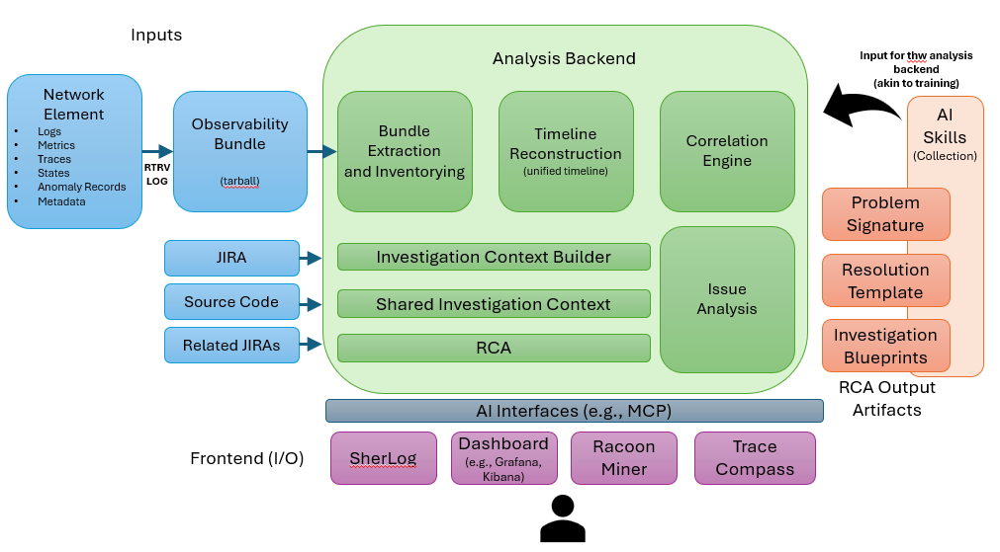
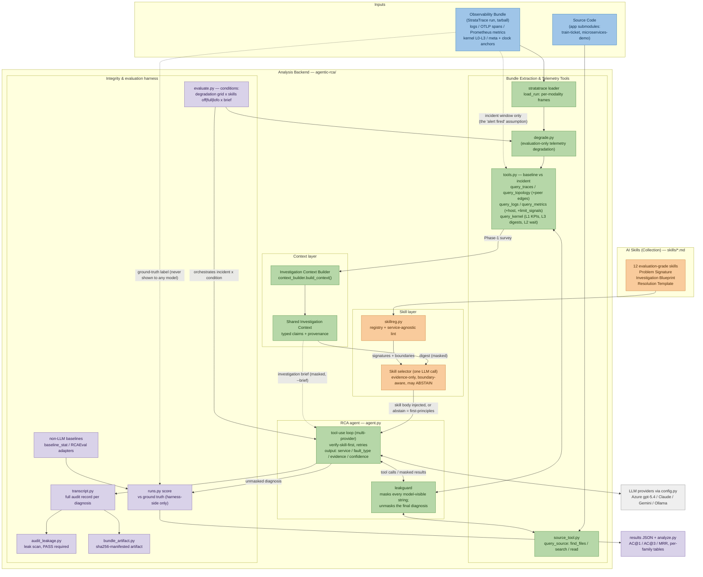

# New System Design — Agentic Analysis Backend (supervisor proposal)

*Drafted 2026-08-14, from the supervisor's design discussion. Maps the proposed architecture
onto the current codebase (branch `new-agentic-architecture`; agent state = frozen gate v3,
`agentic-rca/RESULTS-agent-sanitygate-masked.md`). This is the working design doc for the next
build phase.*



## 1. The proposal in one paragraph

The agentic RCA we have today becomes one component inside a larger **Analysis Backend**. Inputs
stay as observability bundles (tarballs — same shape Ciena uses), but the backend gains
components that "give the agent its brain": an **Investigation Context Builder** that assembles
exactly the context the problem needs (and omits what it doesn't), a **Shared Investigation
Context** the components read/write, additional context sources (**source code**, **past/related
JIRAs**), and an **AI Skills collection** (Problem Signatures, Resolution Templates,
Investigation Blueprints) mined from completed RCAs and fed back "akin to training". The backend
fronts onto Ciena's existing AI ecosystem (SherLog, dashboards, Racoon Miner, Trace Compass) via
AI interfaces such as MCP.

## 2. Block-by-block status vs. our code

| Diagram block | Status | Where it lives today |
|---|---|---|
| Observability Bundle (tarball) | **Built** | StrataTrace run bundles (logs/, otlp/spans.jsonl, metrics, kernel L0–L3, meta/, verification.json) — richer than the diagram ("Anomaly Records" ≈ our QC verdicts; kernel modality is our extension) |
| Bundle Extraction & Inventorying | **Built (minor gaps)** | `stratatrace/loader.py`, `transfer/extract_working_set.sh`, `agentic-rca/runs.py` + manifest, `audit_alignment.py` (six-modality QC) |
| Timeline Reconstruction (unified timeline) | **Partial** | Clock anchors (0.001 ms drift) + every tool reslices onto baseline→incident windows — but no *unified timeline artifact* a consumer can query; alignment exists, the timeline product doesn't |
| Correlation Engine | **Partial** | Deterministic pieces inside `agentic-rca/tools.py` (topology edges, cross-modality baseline→incident deltas, kernel↔service PID attribution, L2 wait attribution); correlation itself happens in the LLM's reasoning, not a standalone engine |
| RCA | **Built — strongest block** | `agent.py` + `tools.py` + leakguard + full transcripts; gate v3 = service 83% / fault 48% / both 48%, leakage-controlled; two non-LLM baselines + RCAEval adapters for comparison |
| Investigation Context Builder | **Built (Phase-1 scope)** | `context_builder.build_context()` — deterministic survey writing typed claims into the SIC; feeds the skill selector (digest) and the injectable brief (`evaluate.py --brief`); retrieval sources still to plug in |
| Shared Investigation Context | **Built (v1, per-investigation)** | `shared_context.py` — typed claim store {kind, subject, predicate, value, text, source}; views: `digest()` (selector) + `format_brief()` (masked injection); full claim set recorded as a `shared_context` transcript event; cross-investigation persistence pending supervisor Q5 |
| JIRA / Related JIRAs | **Not built** | No corpus, no retrieval |
| Source Code input | **Built** | `source_tool.py` → agent tool `query_source` (find_files/search/read, Claude-Code-style; per-app root, traversal-guarded, byte-accounted). TT = full ts-* monorepo (verified on cluster); SS meta-repo has little service source (Tier-1 fork repos could be added as extra roots later) |
| Issue Analysis | **Unclear scope** (§7 Q1) | If it means the broader task family (anomaly detection, explanation, repair — the old T1–T4), only RCA exists; AD is an open todo |
| AI Skills (Problem Signature / Resolution Template / Investigation Blueprint) | **Raw material exists; loop not built** | Transcripts *are* investigation blueprints (every tool call, evidence, reasoning); `fault_catalog.md` per-fault cards are hand-authored problem signatures; nothing yet mines RCA outputs into reusable skills or feeds them back |
| AI Interfaces (MCP) | **Exists, stale** | `agent-first-mvp/mcp_server.py` (demo face); predates the v3 tools — needs rewiring to `RunTools` |
| Frontend (SherLog / Dashboard / Racoon Miner / Trace Compass) | **Not built (Ciena-side)** | Synergy to exploit: our kernel L0 is LTTng CTF — **Trace Compass's native format**, so that bridge is nearly free; `agent-first-mvp/dashboard/` is a stale per-run inspector |

## 2b. As-built system diagram (2026-08-16)

What actually exists today on `new-agentic-architecture` and how it interacts — only built
components (no JIRA retrieval, no skills-mining loop, no MCP/frontends yet). Color code mirrors
the requirements diagram: blue = inputs, green = analysis backend, orange = AI skills,
violet = integrity/evaluation, grey = external.



How to read it against the requirements diagram (§ image above):
- **Bundle Extraction & Inventorying** → loader + tools (with the evaluation-only degradation
  stage between them). **Timeline Reconstruction** exists as the baseline→incident windowing
  inside every tool, not yet as a standalone artifact. **Correlation Engine** exists as the
  deterministic pieces inside tools (topology edges, cross-modality deltas, wait attribution) +
  the LLM's reasoning.
- **Investigation Context Builder / Shared Investigation Context / RCA** map 1:1 to
  `context_builder.py` / `shared_context.py` / `agent.py`.
- **AI Skills (Collection)** is the markdown library feeding the selector; today it is
  human-authored — transcripts are the raw material for the future mining loop
  ("akin to training"), which is not built.
- Two components the requirements diagram does not show, which our research setting requires:
  **leakguard** (the masking boundary that keeps evaluation honest) and the **integrity &
  evaluation harness** (transcripts, leak auditor, scoring, artifact bundling).
- Not built yet (deliberately absent here): JIRA / Related-JIRAs retrieval, skills-mining
  feedback loop, unified-timeline artifact, standalone correlation engine, MCP interface,
  frontends (SherLog / dashboards / Racoon Miner / Trace Compass).

## 3. Build plan (proposed order)

1. **Investigation Context Builder** — the headline gap. A deterministic module that runs the
   survey pass *before* the agent starts: extracts the incident window, computes what-changed
   summaries across all modalities, ranks blast-radius candidates, pulls related past
   incidents/code, and emits a compact **investigation brief**. Gate v2→v3 already proved the
   survey discipline is what makes or breaks the agent; today the agent re-derives it with ~5
   tool calls per incident. A deterministic builder makes it cheaper, reproducible, and reusable
   by non-LLM consumers.
2. **Shared Investigation Context** — the substrate the builder writes into: a typed store of
   claims ("edge front-end→catalogue ×11.6", "mysql 100% off-CPU external wait"), each with
   source pointers back into the bundle. The transcript event schema is a good starting shape.
3. **Retrieval sources plugged into the builder** — source-code tool first (corpus in-repo,
   fault-agnostic, zero leakage risk); then related-incidents retrieval — pre-Ciena, our 93
   labeled incidents + transcripts can stand in for JIRA as pseudo-tickets.
4. **Skills loop** — mine Problem Signatures / Resolution Templates / Investigation Blueprints
   from completed RCA transcripts; feed back through the Context Builder. Gated on §4.
5. **MCP face refresh** + Trace Compass bridge when Ciena integration becomes concrete.

## 4. Design tension: the skills loop vs. evaluation integrity

Two gate cycles (13-08) proved the agent's numbers are only meaningful when it isn't handed
hints. **Problem Signatures and Resolution Templates fed back into the backend are, by
construction, a hint channel** — right for a production assistant, contaminating for the research
measurement. Resolution: make it an explicit switch.

- **Assistant mode**: skills + JIRA context ON — the Ciena-facing product.
- **Evaluation mode**: skills OFF, or skills-ON as a *measured condition* with its own results
  column (a paper-worthy ablation: "what is accumulated experience worth?").
- Related-incidents retrieval must exclude the incident under investigation and (for the honest
  headline) its fault family. `audit_leakage.py` grows checks for this once retrieval exists.

Versioning discipline: **v3 = frozen sweep agent** (degradation study runs on this, unchanged);
**v4 = context-builder architecture** developed in parallel on this branch. Never co-vary.

## 5. Skill-based RCA architecture (v4) — decided 2026-08-15

Decision (Yuvraj): move from one monolithic prompt to a **skill library**, like the MVP — so the
product can be handed to anyone and they author skills for the problems *they* face — while
keeping the leak-free evaluation discipline. The MVP's skills prove the concept but cannot be
reused as-is: they were selected by the user's problem statement (in evaluation, that IS the
ground-truth label) and their bodies hard-code the answers (`fault_source: slow_db`,
`target_services: [catalogue, catalogue-db]`, the expected finding spelled out).

### 5.1 The two-phase flow

```
incident bundle
   │
   ▼
Phase 1 — SURVEY (generic, always the same):
   Investigation Context Builder runs the baseline→incident survey
   → evidence signature into the Shared Investigation Context
   │
   ▼
Skill selector: match evidence signature against each skill's problem_signature
   │  (explicit ABSTAIN option + confidence threshold; selection logged in the transcript)
   ├─ match → Phase 2a — skill-guided investigation (blueprint steers tool use,
   │           resolution template sharpens the fault-type verdict)
   └─ abstain → Phase 2b — first-principles fallback = the frozen v3 method
```

Key properties:
- **The generic v3 method is the floor, not a competitor.** Skills are additive guidance on top
  of the same tools; with an empty library the system IS v3. This is the product story ("works
  out of the box, gets better as you add skills") and the scientific control.
- **Two selection modes.** Assistant mode: user's problem statement may drive selection
  (`user_triggers`, like the MVP). Evaluation mode: selection uses ONLY the Phase-1 evidence
  signature — nothing states the problem.
- **Skill authoring = one markdown file.** No code. Customers describe: what the problem looks
  like in evidence (problem_signature), how to investigate it (investigation_blueprint), how to
  decide the verdict (resolution_template). Mined-from-transcript skills come later (the diagram's
  "RCA Output Artifacts → akin to training" loop).

### 5.2 Skill format (draft — example in `agentic-rca/skills/`)

```yaml
---
name: db-latency-rca
version: 1
authored_by: human            # or: mined:<transcript refs>
user_triggers: ["database is slow", "db latency"]     # assistant mode ONLY
problem_signature:            # evidence patterns, matched against the Phase-1 survey
  - topology: slow edges converge on one service that has no slow outgoing edges
  - kernel: the converged-on service shows dominant off-CPU external I/O wait, no saturation
  - metrics: the converged-on service is resource-quiet while its callers degrade
---
## Investigation blueprint
1. Confirm convergence (query_topology): the culprit has slow INCOMING edges only.
2. query_kernel on it: expect external-I/O wait without CPU/memory/disk saturation.
3. Rule out alternatives: disk (block latency), CPU cap (throttled seconds), memory (reclaim).
## Resolution template
- db_latency: calls SUCCEED but slowly; the datastore waits on external I/O, unsaturated.
- dependency_outage instead if calls FAIL/hang to timeout and it serves little traffic.
```

Rules for **evaluation-grade** skills (enforced by an extended `audit_leakage.py`):
service-agnostic ("the converged-on datastore", never `catalogue-db`), no run/app-specific tokens,
no injected-container names. Customer skills in assistant mode may of course name their own
services — that's the product; it's only the benchmark that must stay service-blind.

### 5.3 What changes in code (v4 work items) — BUILT 2026-08-15

1. ✅ `skillreg.py` — registry/loader (markdown frontmatter + 3 sections, no YAML dep),
   service-agnostic lint, abstain-aware one-call selector (evidence-only input).
2. ✅ `context_builder.py` — deterministic Phase-1 survey digest (Context Builder seed).
3. ✅ Selection logged as `skill_selection` transcript events (plus `survey`, `skill_injected`).
4. ✅ Phase-2 injection into the system prompt with an explicit "abandon the skill if evidence
   contradicts it" instruction; abstain → frozen v3 first-principles fallback.
5. ✅ `evaluate.py --skills off|full|lofo` (+`--skills-dir`); harness-side selection scoring via
   `covers`; `audit_leakage.py` audits the new channels (survey/selector = per-incident scan;
   skill text = static scan + service-name lint).
6. ✅ 12 evaluation-grade skills authored (one per injected family), all lint-clean.
v3 stays frozen on `master` for the degradation sweep; v4 lives on this branch.
Smoke (2026-08-15): S1 SS anomaly_disk = right skill @0.98 → fully correct in 11 calls;
S2 (LOFO) same incident = correct ABSTAIN @0.91 → fallback still fully correct — the
never-seen-fault path works. TT slow_db false-matches service-network-path in both modes
(its evidence is genuinely path-shaped) → the selection-confusion data the campaign measures.

## 6. Evaluating a skill-based system (including never-seen faults)

Three library conditions over the same incidents, same tools, same masking:

| Condition | Library contents | What it measures |
|---|---|---|
| **S0 skills-off** | empty | the generic floor — already measured: v3 = 83 / 48 / 48 |
| **S1 skills-full** | one skill per injected fault family | ceiling: value of a complete library ("skill lift" per family = S1 − S0) |
| **S2 LOFO** (leave-one-family-out) | per incident: every skill EXCEPT the incident's own family | **the never-seen-fault claim** — 11 present skills act as distractors |

**S2 is the answer to "how do we prove it handles unseen problems":** for every incident, the
correct skill does not exist, so the system must (a) *abstain* rather than force a wrong skill,
and (b) fall back to first-principles and still solve it. Report:

- **Selection quality**: precision on S1 (right skill chosen when present), abstention recall on
  S2 (no skill forced when absent), false-match rate (which wrong skills attract which faults —
  the confusion structure is itself interesting).
- **Task accuracy per condition**: the headline plot is S1 vs S0 vs S2 per family. The
  graceful-degradation claim is **S2 ≈ S0** (unseen fault costs you the skill lift, never more).
  If S2 < S0, distractor skills actively mislead — an important negative result either way.
- **Cost**: skills should REDUCE tool calls/tokens on matched families (blueprint replaces
  exploration); report calls/tokens per condition.
- Optional diagnostic **S3 forced-wrong-skill**: inject a deliberately wrong skill to quantify
  worst-case distractor damage (robustness bound for customer-authored bad skills).

Strengthening the claim beyond LOFO (later, no re-collection needed first): compound/novel
faults — e.g. evaluate Train Ticket incidents with a library authored ONLY from Sock Shop
transcripts (cross-application transfer: skills written on app A, faults on app B), and
eventually F13+ faults never injected during library construction.

Integrity rules carried over: masking stays ON; selection in evaluation mode sees only evidence;
LOFO retrieval excludes the incident's family by construction; every run keeps full transcripts +
`audit_leakage.py` PASS as shipping criteria.

## 7. Open questions for the supervisor

1. **"Issue Analysis" vs "RCA"** — the broader task family (detection, triage, explanation,
   repair)? A post-RCA drill-down? Its own agent? Determines whether it's a new component or a
   relabeling.
2. **Is the Correlation Engine meant to be deterministic/LLM-free?** Today correlation happens in
   the agent's reasoning over deterministic tool outputs. A standalone engine emitting candidate
   correlations without an LLM is a different, substantial component — and overlaps with the
   Context Builder.
3. **Which mode is the deliverable** — production assistant (skills/JIRA on) or the measured
   research system (leakage-controlled)? Presumably both; the diagram doesn't distinguish, our
   evaluation discipline requires it to be explicit.
4. **JIRA corpus before Ciena data** — synthesize pseudo-tickets from our own incidents, or defer
   until real Ciena JIRAs are available?
5. **Shared Investigation Context semantics** — single-investigation working memory vs persistent
   cross-investigation knowledge (which overlaps the Skills collection)? Single-agent or
   multi-agent blackboard?
6. **Where does kernel telemetry sit?** The Network Element list (RTRV-LOG) has no kernel traces —
   our main differentiator. Folded under "Logs/States", or a StrataTrace-side extension the Ciena
   path won't have? Affects how portable the Context Builder must be.
7. **Unified timeline consumers** — the agent, the frontends (Trace Compass/dashboards), or the
   Correlation Engine? Decides its format (queryable store vs rendered artifact).
8. **Freeze discipline** — confirm: degradation sweep runs on frozen v3 while v4 (this design) is
   developed in parallel; v4 gets its own gate before any of its numbers are quoted.
