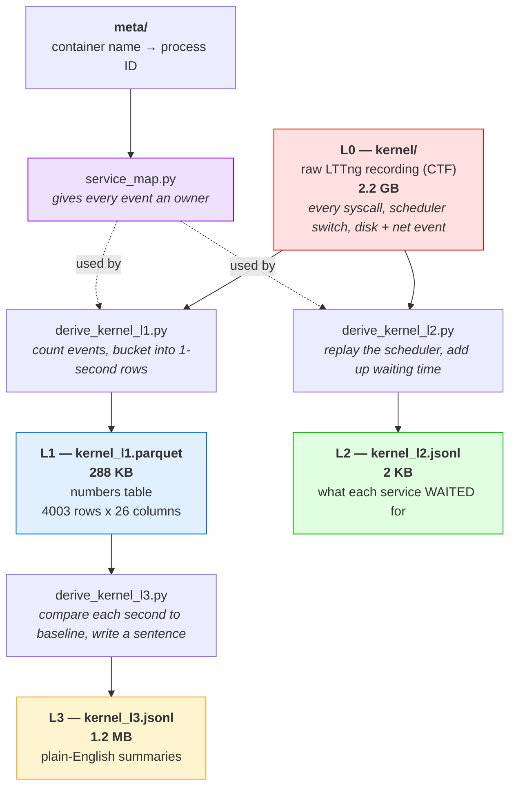
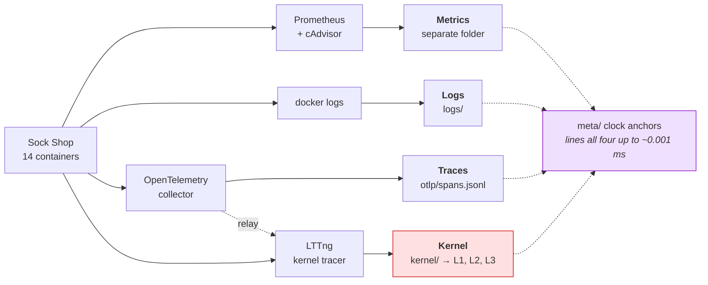

# Understanding the StrataTrace dataset

A guide for someone opening this data for the first time.
Example used here: `data-sample/anomaly_cpu/` — one complete fault family,
recorded 3 times. **13 GB for 3 runs.**

---

## 1. What is one "run"?

One run = **one failure, recorded from start to finish**.

We took a working microservice app (Sock Shop — an online shop made of 14
containers), broke it on purpose in one known way, and recorded everything
that happened.

Every run is 4 minutes long and has 3 phases:

| Time | Phase | What is happening |
|---|---|---|
| 0:00 – 1:00 | Baseline | App is healthy. This is the "before" picture. |
| 1:00 – 3:00 | Fault | We inject the fault. |
| 3:00 – 4:00 | Recovery | We remove the fault. |

The baseline matters a lot. Almost every number in this dataset is
**"fault compared to baseline"**, not a raw value. A number like "5 ms" means
nothing on its own. "5 ms, was 0.5 ms before" means something.

## 1b. How the dataset is packaged

You do not have to download everything. The full set is about 330 GB.

| Download | Size | Use it when |
|---|---|---|
| `stratatrace-lite.tar.gz` | ~1 GB | You want to look at every run, but only the small files: the answer, the verification, metrics, load results, and all three kernel summary levels. **Start here.** |
| `<app>/<fault>.tar.gz` | 2–25 GB | You are working on one kind of failure and need the raw traces, logs and kernel recording too. |

`manifest.csv` at the top lists every run with its label, target, timing and which
files it has, so you can pick without downloading anything.

## 2. Reading the run name

```
anomaly_cpu _ aggressive _ steady _ r1
    |            |           |       |
    |            |           |       └── repeat number (we run each one 3 times)
    |            |           └── load pattern (steady traffic, or burst)
    |            └── how hard we broke it (aggressive or subtle)
    └── which fault (here: host CPU overload)
```

So this run is: *host CPU overload, hard version, steady traffic, first try.*

## 3. What is in the folder

The family folder holds the 3 repeats:

```
data-sample/anomaly_cpu/
├── anomaly_cpu_aggressive_steady_r1/     4.0 GB
├── anomaly_cpu_aggressive_steady_r2/     4.0 GB
└── anomaly_cpu_aggressive_steady_r3/     4.0 GB
```

Each run holds everything about that run — you never need to look elsewhere:

```
anomaly_cpu_aggressive_steady_r1/          4.0 GB total
├── RUN-INFO.txt                      start here: what broke, when, what is here
├── ground_truth.json       614 B     the answer
├── verification.json       876 B     proof the fault really happened
├── verification.png       18 KB      a picture of that proof
├── metrics/               900 KB     Prometheus metrics
├── load.csv                11 MB     per-request results from the load generator
├── kernel/                 2.2 GB    RAW kernel recording  (this is "L0")
├── ust/                    188 MB    raw span events, kernel-side copy
├── otlp/spans.jsonl        1.3 GB    traces (requests moving between services)
├── logs/                   409 MB    logs (one file per container)
├── kernel_l1.parquet       288 KB    kernel, level 1
├── kernel_l2.jsonl          2 KB     kernel, level 2
├── kernel_l3.jsonl         1.2 MB    kernel, level 3
└── meta/                    16 MB    bookkeeping (clocks, container→process map)
```

> **If your copy looks different**, it is an older download. Before August 2026
> the metrics and load results sat *beside* the run folder as `<run>_metrics/`
> and `<run>_load.csv`, and `kernel_l2.jsonl` was not shipped at all. Everything
> now lives inside the run. You can rebuild L2 from `kernel/` — see section 5.

---

## 4. File by file

### `ground_truth.json` — the answer key

What we broke, where, and exactly when.

```json
"name": "anomaly_cpu",
"scope": "host",
"parameters": {"workers": 24, "cpu_load": 100, "container": "anomaly-cpu-stress"},
"target_service": "host",
"expected_winning_modality": "kernel",
"injection_start_utc": "2026-07-28T22:44:53Z",
"injection_end_utc":   "2026-07-28T22:46:54Z"
```

**How we got it:** the fault script writes this file itself when it runs. So the
label is not written by hand afterwards — it comes from the thing that caused
the fault. It cannot disagree with what actually happened.

`expected_winning_modality` is our **prediction, written before any experiment**,
about which data source should solve this fault. It is there so we cannot
change our minds later and claim we were right all along.

> **Important:** an AI model being tested on this data must never see this file.
> It is only for scoring answers afterwards.

### `verification.json` — proof the fault worked

Injecting a fault does not guarantee anything actually broke. So we check.

```json
"promql": "100 - (avg(rate(node_cpu_seconds_total{mode=\"idle\"}[1m])) * 100)",
"baseline_mean":  27.8,     ← CPU was 28% busy before
"injection_mean": 95.9,     ← CPU was 96% busy during
"delta_sigma": 5.292,       ← 5.3 standard deviations away from normal
"passed": true,
"verification_status": "confirmed"
```

**How we got it:** after each run, a script asks Prometheus a fixed question
for that fault type, compares baseline vs fault, and needs the change to be
big (in standard deviations), in the right direction, and to last. If a run
fails this check, it is marked and not used as a clean example.

### `verification.png` — the same proof, as a picture

The same check drawn as a graph. The pink band is the injection window. You can
see host CPU climb to 100% inside the band and fall away after it.

Open this first. It takes one second and tells you whether the run is any good.

### `kernel/` — the raw kernel recording (L0)

This is the biggest thing in the folder (2.2 GB) and the most important.

```
kernel/kernel/
├── metadata               describes the format of the events
├── channel0_0.gz  …  channel0_11.gz     12 files, ~190 MB each
└── index/                 lets a reader jump around without reading it all
```

**How we got it:** LTTng recorded every system call, every scheduler switch,
and every disk and network event on the machine for the whole 4 minutes. One
file per CPU core, gzipped.

The format is **CTF** (Common Trace Format) — binary, not text. You need
`babeltrace2` to read it. Do not try to open it in an editor.

You will almost never read this directly. It is here for two reasons: it proves
the summaries are real, and it lets anyone rebuild L1, L2 and L3 from scratch
with different settings.

### `ust/` — span events, recorded kernel-side

188 MB, same CTF format, and easy to mistake for a duplicate of the traces. It
is not.

**How we got it:** each instrumented service prints its spans to its own log.
A small relay (`agents/otel-to-lttng.py`) reads those lines as they appear and
re-emits them as LTTng events, so they land in the *same recording* as the
kernel events.

**Why bother:** it is a **clock bridge**. Application traces and kernel events
normally use different clocks, so lining them up is guesswork. By writing the
spans into the kernel recording too, we get the same span stamped by both
clocks, which pins the offset exactly. That is how we get ~0.001 ms alignment.

Spans for analysis come from `otlp/spans.jsonl`, not from here.

### `otlp/spans.jsonl` — traces

A trace follows one user request as it hops between services. Each hop is a
**span** with a start time, end time, and parent.

One span looks like:

```json
{"traceId": "d267688f...", "spanId": "b0668150...", "parentSpanId": "7c329455...",
 "name": "middleware - cookieParser", "kind": 1,
 "startTimeUnixNano": "1785278634831000000",
 "endTimeUnixNano":   "1785278634831070721"}
```

`parentSpanId` is what makes it a tree — that is how you rebuild
"front-end called catalogue, which called catalogue-db".

**How we got it:** we added OpenTelemetry to the services, which sends spans to
a collector, which writes them to one big file. Note the file is 1.3 GB but only
1277 lines — each line is a *batch* of many spans, not one span.

`otlp/slice_info.txt` records the byte range we cut out for this run:

```
start_offset=36360463413
end_offset=37665219682
```

The collector writes one endless file for all runs. Rather than stopping and
restarting it (which loses data), we note where each run starts and stops in
the file and slice it out later.

**The blind spot:** only services we instrumented produce spans. Databases,
RabbitMQ and proxies do not. In traces they only ever appear as "something
the caller was waiting on". This is a big reason we added kernel data.

### `logs/` — one file per container

Plain application logs, one file per container, with timestamps:

```
2026-07-28T22:43:53.842182554Z ts=... caller=logging.go:56 method=Get
    id=510a0d7e-... err=null took=1.101237ms
```

**How we got it:** `docker logs --timestamps` for every container, limited to
the run's time window. Some containers (like `catalogue-db`) produce an empty
file — that is normal, not a bug. Databases are quiet unless something is wrong.

### `meta/` — the bookkeeping folder

Snapshots taken at start, at end, and every ~11
seconds during the run.

| File | What it holds |
|---|---|
| `runinfo_*.txt` | timestamps, hostname, kernel version, **clock anchors**, NTP status |
| `proc_<container>_*.txt` | **container name → host process ID** |
| `container_list_*.txt` | which containers were alive at that moment |
| `docker_ps_*.txt`, `top_*`, `inspect_*` | container state, CPU/memory, full config |
| `ps_threads_*.txt` | every thread on the machine (PID, TID, CPU) |

Two of these do real work:

**1. Clock anchors.** The kernel tracer stamps events with one clock; logs and
traces use a different one. If you cannot line them up, four data sources are
worthless together. So each snapshot records all three clocks at the same moment:

```
clock_realtime_ns=1785278635047032344
clock_monotonic_ns=21722546608661
clock_boottime_ns=21722546610690
ntp_System time : 0.000002512 seconds slow of NTP time
```

That gives us the offset between clocks. Measured alignment error is about
0.001 ms.

**2. Container → process map.** The Linux kernel does not know what a
"service" is. It only sees process IDs. `proc_docker-compose_catalogue_1_start.txt`
says:

```
container=docker-compose_catalogue_1
host_pid=2092
```

Without this file, kernel data is a pile of numbers with no owner. With it,
every kernel event can be assigned to a service. We snapshot it repeatedly
because containers can restart and get new PIDs mid-run.

---

## 5. The kernel data: why there are three levels

We record everything the Linux kernel does with **LTTng**: every system call,
every scheduler switch, every disk and network event.

This raw recording (we call it **L0**) is **2–13 GB per run**. It is useful
as proof, but you cannot read it, and you certainly cannot hand it to an AI
model. So we boil it down in three steps. Each step is made by a **fixed
script** — no AI, no judgement calls, so it is reproducible.



Three things to notice in that diagram:

**1. L2 comes from L0, not from L1.** This surprises people. L1 only *counts*
events, and counting can never tell you *why* a thread stopped running. L2
needs the raw scheduler events for that, so it goes back to the source.

**2. Each step shrinks the data enormously.** 2.2 GB becomes 288 KB becomes
2 KB. The 2 KB file is the one that usually solves the case.

**3. Nothing here uses AI.** Every arrow is a fixed script. Run it twice, get
the same answer. That matters because these files are then used to *test* AI
models — the input has to be trustworthy.

### L1 — the numbers table

4003 rows × 26 columns. One row = **one service, one second**.

| service | window_start_s | sys_lat_p95_ms | sched_switch | sys_io |
|---|---|---|---|---|
| carts | 0.0 | 4.5226 | 1403 | 3618 |
| carts-db | 0.0 | 9.9908 | 959 | 64 |
| catalogue | 0.0 | 0.5277 | 2183 | 1922 |

Columns cover system call latency (p50/p95/p99), disk latency, scheduler
activity, network bytes, memory reclaim, page faults, and syscall counts split
by kind (io / net / futex / poll / mem / proc).

Three "services" in here are not app services:
- `aggressor` — the container we used to cause the fault
- `system`, `kernel` — everything not owned by a container

### L2 — what the service was waiting for

The most useful file, and the smallest (2 KB, 3 records).

> **Not in this download.** Build it yourself from `kernel/`:
> `python3 stratatrace/derive_kernel_l2.py <run_dir>`
> (needs babeltrace2 version 2.1 or newer). The example below is from the same
> fault family on our cluster.

L1 tells you a service was slow. L2 tells you **why**. It splits each
service's time into four buckets:

```json
"service": "catalogue",
"rule_out_pct": {
    "on_cpu": 1.2,             ← doing actual work
    "runnable_wait": 5.1,      ← ready to run, but no free CPU  (CPU starvation)
    "disk_wait": 0.0,          ← waiting for disk
    "off_cpu_io_wait": 93.7    ← blocked on something else (database, network)
},
"verdict_hint": "external_io_or_dependency_wait"
```

This is the difference between **"this service is slow"** and **"this service
is stuck waiting for someone else"**. Normal metrics cannot tell those apart —
both just look like high latency.

**How we got it:** by replaying the scheduler events. Every time the kernel
takes a thread off the CPU it records why. Add those reasons up over the fault
window and you get the four numbers.

### L3 — English summaries

4003 lines. One line = one service, one second, written as a sentence:

```json
{"service": "aggressor", "window_start_s": 60.0,
 "digest": "aggressor @ t=60s: block p95 latency 2.4x (0.2->0.6 ms).",
 "deviations": ["block p95 latency 2.4x (0.2->0.6 ms)"]}
```

**How we got it:** a fixed template compares each second against the baseline
minute and writes out anything that moved a lot. The real numbers are always
included in the sentence.

Because a template writes it and not a language model, it **cannot make things
up**. Every claim traces back to a number in L1.

### The scripts that build all this

All four live in `stratatrace/`:

| Script | Reads | Writes | What it does |
|---|---|---|---|
| `derive_kernel_l1.py` | L0 + `meta/` | `kernel_l1.parquet` | Counts events per service per second |
| `derive_kernel_l2.py` | L0 + `meta/` | `kernel_l2.jsonl` | Replays the scheduler to find waiting time |
| `derive_kernel_l3.py` | `kernel_l1.parquet` | `kernel_l3.jsonl` | Compares to baseline, writes sentences |
| `service_map.py` | `meta/` | (helper) | Maps process ID → service name |

`service_map.py` is not a level, but nothing works without it. Kernel events
only carry a process name, and that name is a bad label: three Sock Shop
services are all called `app`, and the Train Ticket services are all called
`java`. Keying on the name alone produced **229 fake "services"** on a real run.
So it uses the container's main process ID from `meta/` instead, which is exact.

Run them one run at a time:

```bash
RUN=data-sample/anomaly_cpu/anomaly_cpu_aggressive_steady_r1

python3 stratatrace/derive_kernel_l1.py $RUN
python3 stratatrace/derive_kernel_l2.py $RUN
python3 stratatrace/derive_kernel_l3.py $RUN     # needs L1 to exist first
```

L1 and L3 are already in the download, so only L2 needs building.

Or in bulk: `transfer/derive_l2_working_set.sh` (Sock Shop) and
`train-ticket-collection-scripts/batch_derive_tt.sh` (Train Ticket).

L1 and L2 need **babeltrace2** to read the raw recording. L3 does not — it only
reads the L1 table, so it runs anywhere.

---

## 6. How the fault itself was made

For this run, `faults/anomaly_cpu.sh` did:

```bash
docker run -d --name anomaly-cpu-stress alexeiled/stress-ng:latest-ubuntu \
    stress-ng --cpu 24 --cpu-method matrixprod --cpu-load 100
```

24 workers (2 per CPU core) burning 100% CPU with matrix multiplication.
"aggressive" picks these numbers; "subtle" uses half the cores at 50% load.

The same script writes `ground_truth.json` when it starts and removes the
container when it ends. There are 12 fault scripts like this, covering host
overloads, per-service limits, slow databases, error bursts, frozen
dependencies, queue backlogs, and network problems.

---

## 7. The four data sources side by side

| Source | Size here | Question it answers | Weakness |
|---|---|---|---|
| Metrics | (separate folder) | Is CPU/memory/network unusual? | Says *what*, never *why* |
| Logs | 409 MB | What did the app report? | Only what someone bothered to log |
| Traces | 1.3 GB | Which call in the chain got slow? | Blind to uninstrumented parts (databases, queues) |
| Kernel | 2.2 GB raw → 1.5 MB summarised | What was the machine really doing, and what was it waiting for? | Needs the container→PID map to be usable |

They are all recorded at the same time, on one clock, so you can look at the
same second across all four. That is the point of the dataset.



The dotted relay arrow is the `ust/` trick from section 4: spans are copied into
the kernel recording so both clocks stamp the same event.

---

## 8. Quick start

Look at `verification.png` first — one second, and you know if the run is good.
Then:

```python
import pandas as pd, json

run = "data-sample/anomaly_cpu/anomaly_cpu_aggressive_steady_r1"

truth = json.load(open(f"{run}/ground_truth.json"))               # the answer
l1    = pd.read_parquet(f"{run}/kernel_l1.parquet")               # numbers table
l3    = [json.loads(l) for l in open(f"{run}/kernel_l3.jsonl")]   # English summaries

# What did the CPU overload actually do? Compare baseline vs fault window.
before = l1[l1.window_start_s <  60].groupby("service").sys_lat_p95_ms.mean()
during = l1[(l1.window_start_s >= 60) & (l1.window_start_s < 180)] \
            .groupby("service").sys_lat_p95_ms.mean()
print((during / before).sort_values(ascending=False).head())
```

Reading the raw kernel recording needs babeltrace2 — and the channels are
gzipped, which babeltrace2 cannot read directly. Unzip a copy first:

```bash
RUN=data-sample/anomaly_cpu/anomaly_cpu_aggressive_steady_r1
cp -r $RUN/kernel/kernel /tmp/ctf && gunzip /tmp/ctf/*.gz
babeltrace2 /tmp/ctf | head -20
```

The deriver scripts do this unzip-to-temp step for you, and clean up afterwards.
Expect roughly 8 GB unzipped, so do not do this on a small disk.

To see it the way our AI agent sees it (raw files turned into short summaries):

```bash
python agentic-rca/peek_run.py --run <path-to-run> --raw
```

Full dataset: 95 runs, 2 apps (Sock Shop and Train Ticket), 12 fault types,
about 2.7 TB raw.
